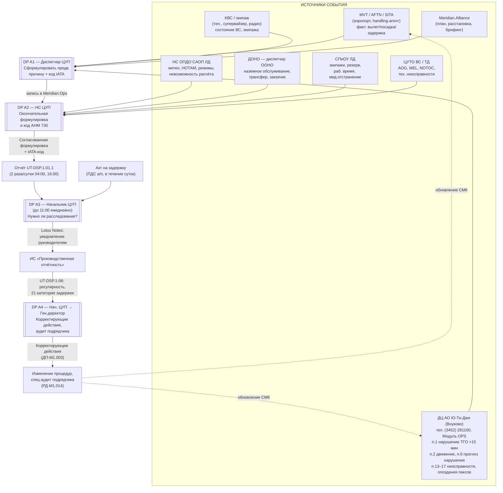
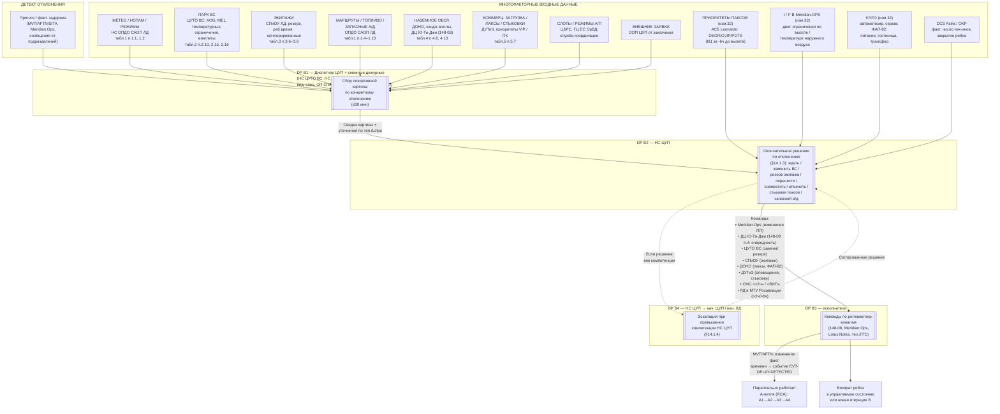

# AS-IS: потоки данных в ЦУП по двум темам

> **Версия 2.1** (после внешнего reality check на КК62-26 и подключения 10-го источника): в B-петлю встроены входящие потоки данных из `КД-РД-Б1.041-04 «Управление нештатными ситуациями»` (эталон №32 от 24.04.2026 — финальная редакция, прямой ответ на повестку Комитета по производственной деятельности). Дифф v2.0 → v2.1 — в §10. История v1.0 → v2.0 — в §9.

**Темы фокуса:**
1. Проведение **RCA** (root-cause analysis) по задержкам рейсов с циклом изменений, направленных на улучшение процедур.
2. **Оперативное управление регулярностью** — петля принятия решений по каждому отклонению в плане полётов: НС ЦУП и оперативная смена реагируют на каждое нарушение регулярности (минуты–часы), используя многофакторные данные.

**Цель файла:** зафиксировать AS-IS-схему потоков данных, сходящихся в точки человеческого принятия решений, чтобы оценить достаточность данных для развёртывания ИИ-ассистента.

**Источники анализа (10 документов):**
- 9 базовых из `input2/ЦУП/`: `КД-ДП-Б8.007-05`, `КД-РГ-147(148)-08`, `КД-РИ-Б1.071-06`, `РГ-128-06`, `РД-Б8.003-11`, `РД-Б8.005-09`, `РИ-Б8.014-07`, `РИ-Б8.1.018-06`, `РИ-М1.016-08`;
- + `КД-РД-Б1.041-04 «Управление нештатными ситуациями»` — основной word + 32 листа замены + эталон №31 (действующий) + эталон №32 (вступает 24.04.2026), скачаны через KEEP API в `input2/ЦУП_word/` и распарсены в `input2/ЦУП_md/КД-РД-Б1.041-04/`.

> **Контекст подключения 10-го источника:** материал на Комитет по производственной деятельности **КК62-26** от 23.04.2026 (`input2/ЦУП/КК62-26 ...pdf`) — итог разбора каникулярного периода 31.12.25–11.01.26 + двух кризисов (сбой DCS, Персидский залив). Решение Комитета — внести изменения в `КД-РД-Б1.041-04`. Эти изменения уже отражены в эталоне №32 (вступает 24.04.2026): новый раздел про автоматизированный сервис **KYFO**, машиночитаемые ремарки **DEGR / CVIP / PDTS** в АСБ, префикс **`t / t*`** для ВС с двигательными ограничениями. Все они — **новые входящие потоки данных в ЦУП**, влияющие на решения НС ЦУП в B-петле.

> Примечание: PDF в input2 называется `КД-РГ-148-08`, но внутри документа по титулу — `КД-РГ-147-08` (см. `P2a_KD-RG-148-08.md`). Дальше использую обозначение `КД-РГ-147(148)-08`.

---

## 1. Список decision points (DP) в ЦУП

Из анализа 9 документов выделяются **две одновременно работающие петли** вокруг одной и той же задержки:
- **A — RCA-петля** (постфактум, для улучшения процедур);
- **B — оперативная петля** (здесь и сейчас, для минимизации эффекта на регулярность).

### A. Цикл RCA по задержкам рейсов (с обратной связью на улучшения)

| DP | Кто решает | Что решает | Окно времени | Якорь в нормативке |
|---|---|---|---|---|
| **A1** | Диспетчер ЦУП | Предварительная формулировка причины задержки (текст + IATA-код) | ≤15 мин от планового времени | `РД-Б8.005-09` §14.2 табл.1 |
| **A2** | НС ЦУП | Согласование/корректировка окончательной формулировки и кода IATA по AHM 730 | По смене | `РД-Б8.005-09` §14.2 шаги 3,6; `КД-ДП-Б8.007` §10 |
| **A3** | Начальник/зам. начальника ЦУП | Решение о доп. расследовании, информирование руководителей подразделений-виновников | До 11:00 тюм. ежедневно | `КД-ДП-Б8.007` §11 табл.1 этап «Ежедневный» |
| **A4** | Начальник ЦУП → ген. директор | Решение о корректирующих/предупреждающих действиях, спец. аудитах подрядчика | Неделя/месяц/год | `КД-ДП-Б8.007` §11 этап «Глубокий»; `РИ-М1.016-08` §9; `РД-Б8.003-11` §8.4 (РД-М1.014) |

### B. Цикл оперативного управления регулярностью (рутина по каждому отклонению)

> **Триггер:** *каждое* отклонение от планового времени отправления/прибытия рейса (а также прогноз отклонения). Никакого порога. Эта петля работает сотни раз в сутки.

| DP | Кто решает | Что решает | Окно времени | Якорь |
|---|---|---|---|---|
| **B1** | Диспетчер ДО ЦУП + дежурные смежных подразделений (НС ЦУТО ВС, НС ОПДО САОП ЛД, вед. спец. по контролю за расписанием ОП СПиОУ ЛД, диспетчер ООНО ДОНО) | Сбор оперативной картины по конкретному отклонению: статус ВС, экипажа, метео, слотов, паксов, наземного обслуживания | ≤30 мин от получения информации о задержке | `КД-ДП-Б8.007` §11 табл.1 этап «Оперативный»; `РД-Б8.005-09` §14.2 шаг 1 |
| **B2** | **НС ЦУП** | Окончательное решение по отклонению: ждать / заменить ВС / поднять резервный экипаж / перенести / совместить / отменить / искать стыковки паксов / запасной а/д. Информирование заинтересованных сторон. **С 24.04.2026** к входам B2 добавляются машиночитаемые сигналы из АСБ Leonardo / Meridian.OPS / KYFO (см. §4) | минуты–часы для каждого рейса | `РД-Б8.005-09` §14.1.3; **`КД-РД-Б1.041-04` §6, §10–§14, §17 (изм.32)** |
| **B3** | НС ЦУП → исполнители (Ю-Ти-Джи, ЦУТО ВС, СПиОУ ЛД, ДОНО, ДУТиЗ, ДО ЦУП) | Команды по регламентированным каналам (148-08, Lotus Notes, телефон/ГГС, Модуль OPS, Meridian.Ops), СМС-рассылки «>2 ч» / «ВИП», РД в МТУ Росавиации | минуты | `РД-Б8.005-09` §15.1.3.2.2.1–§15.1.3.2.2.8 (взаимодействие с подразделениями); `КД-РГ-147(148)-08` табл. 1–5 |
| **B4** | НС ЦУП → вышестоящий руководитель (нач. ЦУП / нач. ЛД) | Эскалация вопроса вне компетенции НС ЦУП (например, изменение ПП требующее согласования сверху) | по факту | `РД-Б8.005-09` §14.1.4 |

**Связь A↔B:** обе петли работают одновременно с одной и той же задержкой. B решает «что делать сейчас», A фиксирует «что произошло, для статистики и улучшения процедур». Решения B2 (с обоснованиями) — лучший вход для A4 (корректирующие действия), но именно сохранение этих обоснований сегодня отсутствует (см. §6, узкое место №3).

### Связанные контуры (за рамками MVP, но критичны для позиционирования)

- **«Сбойная ситуация»** (`РД-Б8.005-09 §15.1.3.3`) — спец-статус, который НС ЦУП присваивает при прогнозировании или наличии **≥10 задержек по одной и той же причине** (`§15.1.3.3.2`). Это пограничный режим (массовая метео-непогода, сетевой сбой ЦБРС, забастовка хэндлера и т.п.). **В рамках MVP отдельный «C-цикл» не вводится** — типовые сценарии из `КК62-26` (отмена/замена ВС, эвакуация, накопление багажа, сбой DCS, усиление смены) укладываются в B-петлю как сложные кейсы с теми же DP B1–B4. **Фаза 2** ИИ-ассистента — обогатить B-петлю «протокольными плейбуками» из `КК62-26` и `КД-РД-Б1.041-04`.
- **ERP / АНВ / АП** (`РГ-128-06`) — кризисный контур (акты незаконного вмешательства, авиапроисшествия). Эскалация по `§15.1.3.3` и `РГ-128`. **Полностью вне scope ИИ-ассистента** — критичность ошибки несопоставима с рутинным управлением регулярностью.
- **`КД-РД-Б1.041-04` (управление НС с пассажирами)** — с v2.1 рассматривается **не как отдельный третий контур, а как поставщик данных и SLA-таймеров в B-петлю**: сервис KYFO (ФАП-82), ремарки DEGR/CVIP/PDTS, статусы ОКР по DCS, лист трансферных пассажиров. См. §4 и §5.

---

## 2. Источники данных и каналы (универсальная инфраструктура ЦУП)

```text
СИСТЕМЫ                       КАНАЛЫ СВЯЗИ              ЗАПИСИ
──────────────────────        ────────────────          ─────────────────
Meridian.Alliance             AFTN (телеграммы          Журнал приёма-передачи
  ├ Meridian.Net (расписание)   MVT/MVT-OUT/RSP/OKR)    смены (бумажный)
  ├ Meridian.Ops (опер. план)  SITA / SITATEX           Журнал регистрации
  │   + префикс t / t*         Lotus Notes (e-mail)     заявок (бумажный)
  │   (двиг. ограничения)      Телефон/ГГС/радиосвязь   Акт на задержку (ПДС а/п)
  ├ Meridian.Nav (полёт. инфо) Факс / WhatsApp (148-08) Отчёт по рейсам
  ├ Meridian.Crew/Sal          СМС-рассылки             UT-DSP.1-01.1
  └ Meridian.Web                («>2 ч», «ВИП»)         Отчёт UT-DSP.1-06
АСБ Leonardo (бронирование)   ЭП vko.duty-manager     Карты действий
  + ремарки DEGR / CVIP / PDTS  @utg.aero и т.д.        (для спец-режимов §15)
DCS Astra (регистрация)       Сервис KYFO (ФАП-82,    Лист трансферных пассажиров
KYFO (автоматизация ФАП-82)    автоматич. оформление)   (от ОКР по запросу)
ИС «Производственная           Push-уведомления        Отчёт «Состояние парка ВС»
   отчётность» (UT-DSP.1-06)    о факте предост. услуги  (ЦУТО ВС, ежедневно)
ЦБРС / ГЦ ЕС ОрВД                                      Тех.акты, бортжурналы
```

> **Системы, добавленные в v2.1 (источник — `КД-РД-Б1.041-04` изм.32):** **АСБ Leonardo** (хранитель ремарок DEGR/CVIP/PDTS — приоритеты пассажиров, см. §11), **DCS Astra** (статус регистрации — реальное число чек-инов и закрытие рейса), **сервис KYFO** (автоматизированное оформление услуг по ФАП-82: питание, гостиница, трансфер; передаёт push в КЦ и в журнал для ЦУП). **Префикс `t / t*` в Meridian.OPS** — машиночитаемая отметка ВС с ограничениями двигателей по высоте/температуре наружного воздуха.

---

## 3. AS-IS-схема потоков данных: цикл RCA (тема 1) — без изменений



Ключевые «источники истины» по этапам — `КД-ДП-Б8.007-05` §11 табл.1 определяет 3 уровня анализа (оперативный/ежедневный/глубокий) с явным составом участников и записей. **Оперативный уровень** этой же таблицы используется и в B-петле (см. §4) — это та же оперативная смена, но в роли реагирования, а не учёта.

---

## 4. AS-IS-схема потоков данных: оперативное управление регулярностью (тема 2)

> Срабатывает для **каждого** прогнозируемого или фактического отклонения в ПП. Без порога. Сотни раз в сутки.



**Что важно для ИИ-ассистента:** в B2 на каждое решение **одновременно** сходятся **12 категорий** многофакторных входов (8 базовых + 4 новых из `КД-РД-Б1.041-04` изм.32). НС ЦУП делает это устно/в голове, обоснование выбора практически не сохраняется — это основной gap для подключения ИИ.

### 4.1 SLA-таймеры из `КД-РД-Б1.041-04` изм.32 как триггеры B-петли

| T-точка | Что должно произойти | Источник записи | Кто исполнитель | Кто смотрит из ЦУП |
|---|---|---|---|---|
| **СОВ −6ч** | Расстановка ремарок DEGR/CVIP/PDTS в АСБ Leonardo по факту прогноза задержки | АСБ Leonardo + push в КЦ | КЦ | НС ЦУП — как сигнал «есть приоритеты, которые надо учесть в B2» |
| **СОВ −3ч / −2ч** | Подготовка протокола по трансферным паксам (отдельно для аэропорта пересадки и базы) | Лист трансферных, АСБ + DCS | ОКР, ДОНО, КЦ | НС ЦУП — для решения «совмещать / искать стыковки / отказывать» |
| **СОВ +1ч после фактической задержки** | Контроль предоставления услуг по ФАП-82 через KYFO | KYFO журнал + push в КЦ | ДОНО, КЦ | НС ЦУП — для оценки реального уровня компенсаций / репутационного риска |
| **t / t\* в OPS** | Признак «ВС нельзя ставить выше высоты X» / «t наружного воздуха выше Y запрещает запуск» | Meridian.OPS | КЦУТО ВС, КАЭ/КЛО | НС ЦУП — фильтр при выборе подмены ВС в B2 |

**Следствие для ИИ:** все 4 новых таймера и 4 новых входа структурированы и машиночитаемы. Это **усиливает кейс PoC «Co-pilot НС ЦУП по B2»** — сразу появляется готовый структурированный контекст для генерации и обоснования решения.

---

## 5. Матрица «решение ↔ данные ↔ доступность для ИИ»

Колонка «Готовность» — насколько источник пригоден для машинного потребления ИИ-ассистентом без донастройки контура сбора.

| DP | Тип данных | Источник / канал | Структурирован? | Готовность |
|---|---|---|---|---|
| A1 | Факт. время вылета/посадки | MVT/AFTN/SITA → Meridian.Ops | да (формализованные ТГТ) | **высокая** |
| A1 | Голосовые подтверждения супервайзеров | Телефон | нет (устно, без расшифровки) | **низкая** — нужен voice-to-text + capture |
| A1 | Сообщения от КВС/Ю-Ти-Джи | Тел./ГГС/WhatsApp | частично (148-08 жёстко регламентирует адресацию, но не структуру тела) | **средняя** |
| A2 | Уточнения смежных подразделений | Lotus Notes + телефон | полу-структурно (free-text) | **средняя** — НС ЦУП агрегирует в голове |
| A2 | Классификатор IATA AHM 730 | КД-ДП-Б8.007 §10, статичен | да | **высокая** |
| A3 | Скоординированная инфо смены | E-mail сообщения, отчёт по рейсам | смешанная | **средняя** |
| A3 | Акт на задержку | ПДС аэропорта (бумажный/PDF) | разный по а/п | **низкая** (фрагментирован) |
| A4 | Регулярность по категориям | UT-DSP.1-06 PDF/Excel в ИС «Производственная отчётность» | да (21 категория, см. `РИ-М1.016-08` §8.1.2) | **высокая** |
| **B1** | Прогноз/факт отклонения | Meridian.Ops + AFTN MVT | да | **высокая** |
| **B1** | Уточнения от дежурных смежных подразделений | Тел./ГГС, Lotus Notes | смешанная | **средняя** |
| **B2** | Статусы парка (AOG, MEL, винглеты, температура) | Meridian.Alliance + ЦУТО ВС | да | **высокая** |
| **B2** | Статусы экипажей (раб. время, категория, резерв) | Meridian.Crew + СПиОУ | да | **высокая** |
| **B2** | Расчёт топлива, маршрут, запасные а/д | ОПДО САОП ЛД, Meridian.Nav | да | **высокая** |
| **B2** | Погода / НОТАМ (фактич./прогноз) | ОПДО, внешние источники | да | **высокая** |
| **B2** | Слоты, режимы а/п | ЦБРС, ГЦ ЕС ОрВД, координатор | да (РСП/ОКР) | **высокая** |
| **B2** | Коммерч. приоритеты, продажи, паксы на стыковках | ДУТиЗ | частично | **средняя** |
| **B2** | **Обоснование решения по конкретному рейсу** (рассмотренные варианты, критерии, выбор, согласование с нач. ЦУП) | Телефон/устно/«в голове НС ЦУП» | **нет** | **критически низкая** — главный gap для обучения ИИ |
| **B3** | Команды исполнителям | Meridian.Ops + Lotus Notes + тел. + СМС-шлюз | смешанная | **средняя** |
| **B3** | Подтверждения исполнения | MVT/AFTN, Lotus Notes | да | **высокая** |
| **B4** | Согласование с вышестоящим руководителем | Тел./Lotus | нет | **низкая** |
| **B2 (изм.32)** | **Приоритеты пассажиров DEGR/CVIP/PDTS** | АСБ Leonardo (ремарки), push в КЦ | да (формализованные коды) | **высокая** — готовый машиночитаемый сигнал |
| **B2 (изм.32)** | **Двиг. ограничения ВС `t / t*`** | Meridian.OPS (префикс на борту) | да (флаг) | **высокая** — готовый фильтр для подмены ВС |
| **B2 (изм.32)** | **Статус сервиса ФАП-82** (питание, гостиница, трансфер) | KYFO журнал + push в КЦ | да (статус-коды + метки времени) | **высокая** — основа для контроля качества компенсаций |
| **B2 (изм.32)** | **Лист трансферных пассажиров** | АСБ + DCS Astra (ОКР по запросу) | да (структурно) | **средне-высокая** — есть, но требует ручной выгрузки |
| **B2 (изм.32)** | **Факт. число чек-инов и закрытие рейса** | DCS Astra → ОКР | да | **высокая** |
| **B2 (изм.32)** | **Согласованность данных АСБ ↔ DCS ↔ Meridian.OPS** при изменении времени рейса | три системы, синхронизация ручная | нет (расходятся) | **низкая** — новый gap-06, см. §6 |

---

## 6. Выводы по достаточности данных для ИИ-ассистента

**Сильные места (можно стартовать сразу):**

- В B2 на каждое решение НС ЦУП сходятся 8 категорий машиночитаемых входов из `Meridian.Alliance`, ЦУТО ВС, СПиОУ ЛД, ОПДО, ЦБРС. Это происходит **сотни раз в сутки** — большой и постоянный поток для обучения и работы ассистента.
- Цикл RCA на уровне A4 уже структурирован 21-категорийной таксономией задержек (`РИ-М1.016-08` §8.1.2) и хранится в ИС «Производственная отчётность» — готовый датасет для аналитики и поиска повторяющихся коренных причин.
- Жёстко регламентированные SOP-таблицы взаимодействия (`РД-Б8.005-09` §15.1.3.2.2.1–§15.1.3.2.2.8 — взаимодействие с ОПДО / ЦУТО ВС / СПиОУ / ДОНО / ДУТиЗ / А247 / ООП ЦУП / ДО ЦУП; `КД-РГ-147(148)-08` табл. 1–5) дают почти готовую онтологию событий, ролей и адресатов.

**Узкие места (требуют донастройки контура):**

1. **DP A1/A2 — формулировка причины задержки.** Решение принимается на стыке голосовых каналов (телефон, ГГС, супервайзеры, КВС). Без записи и структуризации этих диалогов ИИ не получит входы, на основании которых диспетчер принимает решение. Нужен либо voice-to-text + структуризация, либо обязательная фиксация в чек-листе Meridian.Ops.
2. **DP A3 — акты на задержку от ПДС аэропортов** приходят разрозненно, в разных форматах. Для замкнутого RCA-цикла нужен унифицированный приёмник (OCR + классификатор).
3. **DP B2 — обоснование решения по конкретному рейсу не сохраняется (главный блокер, в v2.1 ещё критичнее).** Сейчас фиксируется только результат (команды по каналам), но не критерии и не альтернативы. **С учётом v2.1** к 8 базовым категориям входов добавляются ещё 4 (DEGR/CVIP/PDTS, `t/t*`, KYFO, DCS) — то есть когнитивная нагрузка на НС ЦУП растёт, а механизма фиксации обоснования по-прежнему нет. Чтобы ИИ-ассистент учился на исторических решениях НС ЦУП, нужно логировать: какие варианты НС ЦУП рассмотрел, какие из 12 категорий использовал, почему выбрал текущий, согласовал ли с вышестоящим.
4. **WhatsApp / устные каналы (148-08)** — не сохраняются. ИИ-ассистент не сможет реконструировать контекст решения постфактум.
5. **Связи между документами**: `РД-Б8.005` ↔ `КД-ДП-Б8.007` ↔ `РИ-М1.016` ↔ `КД-РИ-Б1.071` ↔ `РИ-Б8.014` ↔ `КД-РГ-147(148)-08` ↔ **`КД-РД-Б1.041-04`** сейчас выражены только как ссылки в тексте. Для онтологии ИИ нужно явное связывание (single source of truth по справочникам ВС, экипажей, аэропортов, IATA-кодов, ремарок DEGR/CVIP/PDTS).
6. **(новое в v2.1) Несинхронность данных АСБ Leonardo ↔ DCS Astra ↔ Meridian.OPS при изменении времени рейса.** Когда НС ЦУП в B2 принимает решение «перенести / отменить / совместить», изменение распространяется по трём системам асинхронно (расписание в Meridian.OPS, продажи и ремарки — в АСБ Leonardo, регистрация — в DCS Astra). До формального согласования у НС ЦУП нет единой картины «текущее состояние пакса × текущее состояние рейса × текущее состояние ВС». Этот gap не блокирует MVP, но сразу же вылезет в Pilot — нужен либо CDC из всех 3 систем, либо event-bus.

---

## 7. Рекомендации (расширенные)

### 7.1 Что делать с AS-IS прямо сейчас

| # | Шаг | Артефакт | Кому полезно |
|---|---|---|---|
| 1 | Перенести обе схемы (A и B) в **BPMN 2.0** с lanes по подразделениям и явными data objects | `docs/bpmn/RCA_AS-IS.bpmn`, `docs/bpmn/Operational_Regularity_AS-IS.bpmn` | бизнес-владельцу, IT, разработчику ИИ |
| 2 | Сформировать **каталог data sources** с атрибутами: владелец, формат, периодичность, машинная читаемость, способ доступа (API/файл/AFTN/устно) | `docs/data_sources_catalog_TsUP.md` | архитектору данных |
| 3 | Сформировать **реестр knowledge gaps** — мест, где решение принимается на основании данных, не существующих в системах (телефонный консенсус, экспертное суждение, обоснования B2) | `docs/knowledge_gaps_TsUP.md` | владельцу процесса |
| 4 | Согласовать **онтологию ЦУП**: справочники ВС, экипажей, аэропортов, IATA-кодов задержек (AHM 730), категорий причин (21 категория `РИ-М1.016` §8.1.2), типов событий из таблиц `РД-Б8.005` и `КД-РГ-147(148)-08` | `docs/ontology_TsUP.yaml` | NLP-команде |

### 7.2 Минимально жизнеспособный ИИ-ассистент (MVP)

**Тезис:** не пытаться сразу заместить НС ЦУП, а начать с двух самых дешёвых и «чистых» сценариев.

**Сценарий 1 — «Co-pilot диспетчера ЦУП по B1/A1»:**
- На входе: поток MVT/AFTN/SITA + текстовые сообщения от Ю-Ти-Джи (Модуль OPS) + контекст брифинга из Meridian.
- На выходе: автоматически собранная «оперативная картина» по конкретному отклонению (статус ВС, экипажа, метео, слотов, паксов) + предложенная формулировка причины + IATA-код + список «недостающих фактов», которые диспетчер должен дозапросить (по голосу).
- Что закрывает: ускорение и стандартизация B1/A1, снижение разногласий на A2, повышение качества датасета для A3/A4.

**Сценарий 2 — «Co-pilot НС ЦУП по B2 — генератор и обоснователь решений»:**
- На входе: события из Meridian.Alliance + **12 категорий многофакторных входов** (см. §4 и §4.1) для каждого отклонения, в т.ч. структурированные сигналы изм.32 (DEGR/CVIP/PDTS, `t/t*`, KYFO, DCS Astra) и SLA-таймеры −6ч / −3ч / −2ч / +1ч.
- На выходе: 2–3 предложенных варианта решения (ждать / заменить ВС / резерв экипажа / перенести / совместить / отменить / стыковки) с **карточкой обоснования** для каждого: какие из 12 категорий учтены, как соотнесены с SLA-таймерами `КД-РД-Б1.041-04`, какой ожидаемый каскад, на какие KPI повлияет, какие приоритетные пассажиры (DEGR/CVIP/PDTS) затронуты.
- Что закрывает: компенсирует главное узкое место (узкое место №3) — у НС ЦУП появляются «уже сформулированные» альтернативы, его выбор + комментарий записывается в журнал решений и становится train-set для следующих итераций.
- Это и есть основной долгосрочный продукт ассистента: каждое решение НС ЦУП → новая обучающая запись.

**Сценарий 3 (фаза 2, поверх B-петли) — «Плейбуки `КК62-26`/`КД-РД-Б1.041-04`»:**
- На входе: те же 12 категорий B2 + классификатор события («сбой DCS», «эвакуация», «накопление багажа», «отмена / замена ВС», «усиление смены»).
- На выходе: автоматически развёрнутый чек-лист по соответствующему типовому протоколу (кому позвонить, что внести в KYFO, какие ремарки расставить, в какой временной точке какой статус ожидать).
- Что закрывает: даёт ИИ-ассистенту встроенный handler типовых сценариев из протокола Комитета — снимает повторную координацию с НС ЦУП. Не отдельный C-цикл, а enrichment B-петли.

### 7.3 Что собрать дополнительно перед запуском MVP

1. **Подключение к Meridian.\*** — REST/DB read-only доступ ко всем 4 модулям (`Meridian.Net`, `Meridian.Ops`, `Meridian.Nav`, `Meridian.Web`), см. `КД-ДП-Б8.007` §12.1.1.
2. **Поток AFTN/SITA-телеграмм** — копия в очередь сообщений (Kafka/MQ), с парсингом MVT/MVT-OUT/RSP/OKR.
3. **Журнал решений НС ЦУП по B2** — обязательное поле «обоснование» + «варианты[]» + «согласовал_с» для каждой команды, генерируемой в Meridian.Ops в режиме оперативного реагирования.
4. **OCR-приёмник актов на задержку** от ПДС аэропортов (PDF/скан → структурированная запись).
5. **Голосовые каналы Ю-Ти-Джи / КВС / супервайзеров** — запись и расшифровка хотя бы для постфактум-аудита (политически чувствительно, нужно согласование с РД-М1.014 и юристами).
6. **(новое в v2.1) Подключение к АСБ Leonardo (ремарки DEGR/CVIP/PDTS), DCS Astra (статус регистрации/закрытия), сервису KYFO (журнал ФАП-82-услуг) и к флагу `t/t*` в Meridian.OPS.** Все 4 источника становятся обязательными атомарными сигналами для PoC «Co-pilot НС ЦУП по B2». Owner данных: КЦ (Leonardo, KYFO), ОКР (DCS), КЦУТО ВС (`t/t*`).
7. **(новое в v2.1) Контур синхронизации АСБ ↔ DCS ↔ Meridian.OPS** для борьбы с gap-06 (см. §6) — либо CDC, либо событийная шина с публикацией изменений по рейсу.

### 7.4 Метрики успеха MVP

| Метрика | Базовая (AS-IS) | Цель MVP |
|---|---|---|
| Время от факт. вылета до окончательной формулировки причины задержки | по факту смены (часы) | ≤15 мин для 80% задержек |
| Доля задержек с категорией «Прочее» (`РИ-М1.016` §8.1.2) | TBD из UT-DSP.1-06 | −50% |
| Время от детекта отклонения (B1) до окончательного решения НС ЦУП (B2) | TBD | сокращение в 2–3 раза |
| **Доля решений B2 с задокументированным обоснованием** | **~0%** | **≥90%** |
| Доля повторяющихся коренных причин, по которым запущено корректирующее действие (A4) | TBD | +30% YoY |

### 7.5 Риски и ограничения

- **Регуляторика**: любое решение по управлению ПП имеет нормативный якорь (ВК РФ, ФАП-128, ФАП-82, РПП-2017). ИИ может только **рекомендовать**, окончательная ответственность — на НС ЦУП и начальнике ЦУП. Это явно зашито в `РД-Б8.005-09` §14.1.3.
- **Сертификация СМК**: изменения процедур ЦУП проходят через ДП-М1.003 (управление корректирующими действиями) и РД-М1.014 (аудит качества) — выкатка ИИ в продуктив требует записи в СМК.
- **Спец-режимы вне scope MVP:** «Сбойная ситуация» по `§15.1.3.3` (≥10 однотипных задержек) и ERP/`РГ-128` (АНВ/АП) — не входят в MVP. Их можно поддержать надстройкой над B-петлёй на следующих фазах.
- **Vendor lock**: `Meridian.Alliance` поставляется внешним вендором (см. `КД-ДП-Б8.007` §12.1.5 — инструкции на cloud.utair.ru). Доступ к данным согласовывать с вендором.

### 7.6 Дорожная карта (ориентир)

| Фаза | Сроки (ориентир) | Результат |
|---|---|---|
| 0. AS-IS зафиксирован | завершено | этот документ + 9 OCR'ed PDF |
| 1. BPMN AS-IS + каталог data sources + онтология | 2–3 недели | артефакты §7.1 |
| 2. PoC: «Co-pilot диспетчера» (B1/A1, read-only, тестовый стенд) | 4–6 недель | работающий прототип на исторических данных |
| 3. Pilot в смене ЦУП (1 смена, shadow mode) | 4 недели | метрики §7.4 |
| 4. PoC: «Co-pilot НС ЦУП» (B2 — генератор и обоснователь решений) | 6 недель | прототип с участием НС ЦУП в дизайн-ревью |
| 5. Решение go/no-go по продуктовой раскатке | — | формализация в СМК через ДП-М1.003 |

---

## 8. Перечень ссылок на исходные документы

- `input2/ЦУП/КД-ДП-Б8.007-05 (Эталон 3 для ознакомления).pdf` → `output3/full_run_latest/149_КД-ДП-Б8.007-05/`
- `input2/ЦУП/КД-РГ-148-08 (эталон №2 для ознакомления).pdf` → `input2/ЦУП_md/P2a_KD-RG-148-08.md` (по титулу — `КД-РГ-147-08`)
- `input2/ЦУП/КД-РИ-Б1.071-06 (Эталон 3 для ознакомления).pdf` → `output3/full_run_latest/264_КД-РИ-Б1.071-06/`
- `input2/ЦУП/РГ-128-06 (Эталон № 14 для ознакомления).pdf` → `output3/full_run_latest/331_РГ-128-06/`
- `input2/ЦУП/РД-Б8.003-11 (Эталон №2 для ознакомления).pdf` → `output3/full_run_latest/355_РД-Б8.003-11/`
- `input2/ЦУП/РД-Б8.005-09 (Эталон №8 для ознакомления).pdf` → `output3/full_run_latest/356_РД-Б8.005-09/` + `input2/ЦУП_md/P2b_RD-B8.005-09.md`
- `input2/ЦУП/РИ-Б8.014-07 (Эталон №6 для ознакомления).pdf` → `output3/full_run_latest/377_РИ-Б8.014-07/`
- `input2/ЦУП/РИ-Б8.1.018-06 (Эталон для ознакомления).pdf` → `output3/full_run_latest/378_РИ-Б8.1.018-06/`
- `input2/ЦУП/РИ-М1.016-08 (Эталон для ознакомления).pdf` → `output3/full_run_latest/393_РИ-М1.016-08/`
- `input2/ЦУП/КК62-26 Улучшение координации служб в сбойных ситуациях 23.04.26.pdf` — материал на Комитет по производственной деятельности от 23.04.2026 (внешний триггер для v2.1)
- **`КД-РД-Б1.041-04 «Управление нештатными ситуациями»` (10-й документ, изм.32 от 24.04.2026)** — извлечён из Domino BND через KEEP API (см. `/tmp/download_b1041.py`):
  - `input2/ЦУП_word/КД-РД-Б1.041-04_основной.doc` (1.7 MB) — базовый word
  - `input2/ЦУП_word/КД-РД-Б1.041-04_эталон31_действующий.pdf` — действующий эталон №31
  - `input2/ЦУП_word/КД-РД-Б1.041-04_эталон32_от_24.04.2026.pdf` — финальный эталон №32 (вступает 24.04.2026)
  - `input2/ЦУП_word/КД-РД-Б1.041-04_изм{01..32}_*.docx` — все 32 листа замены
  - `input2/ЦУП_md/КД-РД-Б1.041-04/` — распарсенный текст (PyMuPDF + python-docx, см. `/tmp/extract_b1041.py`)

---

## 9. Дифф v1.0 → v2.0 (исторический, для архива)

> Этот раздел — самодокументирующий журнал изменений между v1.0 (от 2026-04-22) и v2.0. Презентация, артефакты и дашборд **уже** приведены в соответствие c v2.0. Свежие изменения для презентации — в §10 (v2.0 → v2.1).

### 9.1 Что **не** меняется

- Постановка задачи и цель файла (оценка достаточности данных для ИИ-ассистента).
- A-цикл (RCA): таблица DP A1–A4, Mermaid-схема, выводы и метрики A.
- §2 — карта инфраструктуры (системы / каналы / записи).
- §3 — Mermaid-схема цикла RCA (без изменений).
- §7.1 (артефакты), §7.3 (что собрать), §7.5 (риски, кроме одной формулировки), §7.6 (дорожная карта, кроме переименования сценариев).
- §8 — список ссылок на исходные документы.

### 9.2 Что меняется по сути

| Раздел | v1.0 (было) | v2.0 (стало) |
|---|---|---|
| **Тема 2 в шапке** | «Оптимизация решений в сбойной ситуации в условиях многофакторной модели» | «Оперативное управление регулярностью» — петля по каждому отклонению в ПП |
| **Триггер B-цикла** | Накопление **≥10 задержек по одной причине** (§15.1.3.3.2) | **Каждое** прогнозируемое или фактическое отклонение в ПП. Никакого порога |
| **DP B1** | НС ЦУП — присвоение статуса «Сбойная ситуация», вызов руководителей | Диспетчер ЦУП + дежурные смежных подразделений (НС ЦУТО ВС, НС ОПДО САОП ЛД, вед. спец. ОП СПиОУ ЛД, диспетчер ООНО ДОНО) — сбор оперативной картины ≤30 мин |
| **DP B2** | НС ЦУП + начальник ЦУП — выбор сценария разрешения, ≥2 варианта (часы) | НС ЦУП — окончательное решение по отклонению по `§14.1.3` (минуты–часы для каждого рейса) |
| **DP B3** | Менеджер по управлению расписанием — recovery/оптимизация на 72 часа | Исполнители (Ю-Ти-Джи, ЦУТО ВС, СПиОУ, ДОНО, ДУТиЗ, ДО ЦУП) — команды по регламентированным каналам |
| **DP B4** | Начальник ЦУП → оперштаб ERP — эскалация в кризисный режим (`РГ-128`) | НС ЦУП → нач. ЦУП / нач. ЛД — операционная эскалация по `§14.1.4` |
| **Якоря B** | `§15.1.3.3.2`, `§15.1.3.3.4`, `§15.1.3.3.6`, `§15.3`, `РГ-128 §1.1`, `§5.6–5.7` | `§14.1.3`, `§14.1.4`, `§14.2 шаг 1`, `§15.1.3.2.2.1–§15.1.3.2.2.8` (взаимодействие), `КД-ДП-Б8.007 §11 «Оперативный»`, `КД-РГ-147(148)-08 табл. 1–5` |
| **Mermaid §4** | Триггер «≥10», ветка эскалации в ERP при АНВ/АП, recovery 72ч | Триггер «каждое отклонение», цикл B1→B2→B3 без §15-веток, B4 как побочная петля «вне компетенции» |
| **Матрица §5** | Строка «Согласование сценария между НС ЦУП и начальником ЦУП» с готовностью «низкая»; строка «B4 — ERP / RG-128» с готовностью «низкая» | Расширенный набор B-строк (B1, B2, B3, B4 — отдельно); ключевая строка переименована в **«Обоснование решения по конкретному рейсу»** с пометкой **«критически низкая — главный gap для обучения ИИ»**; строка ERP удалена |
| **Узкое место №3 (§6)** | «обоснование выбора сценария в сбойной ситуации» (B2 как редкий кейс) | **«Обоснование решения по каждому отклонению»** (B2 как рутина — главный блокер MVP) |
| **MVP-сценарий 2 (§7.2)** | «Сбойная ситуация — генератор вариантов»: автоматический детектор триггера B1 (10 задержек по одной причине), 3 предложенных сценария разрешения | «Co-pilot НС ЦУП по B2 — генератор и обоснователь решений»: 2–3 варианта на каждое отклонение, карточки обоснования, train-set из решений |
| **§7.4 KPI** | «Время от триггера B1 до согласованного варианта B2» | «Время от детекта отклонения (B1) до окончательного решения НС ЦУП (B2)»; новый KPI: **«Доля решений B2 с задокументированным обоснованием»** (база ~0%, цель ≥90%) |
| **§7.5 Риски** | «ERP/RG-128 — на кризисный контур не стоит расширять MVP» (отдельным риском) | «Спец-режимы вне scope MVP: «Сбойная ситуация» §15.1.3.3 + ERP/РГ-128 — не входят в MVP, можно поддержать надстройкой на следующих фазах» |
| **§7.6 дорожная карта** | Фаза 4: «PoC: Генератор вариантов сбойной ситуации» | Фаза 4: «PoC: Co-pilot НС ЦУП — B2 (генератор и обоснователь решений)» |

### 9.3 Что добавлено

- **Подраздел «Вне фокуса AS-IS»** в §1: явно вынесены спец-режим «Сбойная ситуация» (§15.1.3.3) и ERP/`РГ-128` как **исключённые из основной модели**, с пояснением почему.
- В §1 явная формулировка **связки A↔B**: обе петли работают одновременно с одной задержкой.
- В §4 явный детект-блок (`DET`) как отдельная сущность, связь B2→B3 с подтверждением исполнения через MVT/AFTN, ссылка на параллельную A-петлю.
- В §5 матрицы — расширенные строки B1, B2, B3, B4 (вместо двух строк B2 + B4).
- В §7.5 пояснение про спец-режимы.

### 9.4 Что удалено

- Понятие «триггер ≥10 однотипных задержек» как основной триггер B-цикла (остаётся короткой ремаркой в §1 «Вне фокуса AS-IS» и в §7.5).
- Понятие «recovery на 72 часа как отдельный DP B3» — это часть рутинной работы менеджера расписания, но как отдельная decision point вне B-петли (если потребуется — можно завести как самостоятельный мини-цикл, но не входит в B).
- Понятие «эскалация в ERP / оперштаб RG-128» как один из основных DP — перенесено в «Вне фокуса AS-IS».
- Понятие «АНВ / АП» как ветка решения — полностью удалено (вне scope ИИ-ассистента).

### 9.5 Что нужно поправить в презентации (чек-лист для агента)

1. **Слайд про темы:** заменить «оптимизация в сбойной ситуации» на «оперативное управление регулярностью».
2. **Слайд DP-таблицы B:** заменить таблицу из v1.0 (B1–B4 со «Сбойной ситуацией») на новую таблицу из §1.B этого файла. Якоря — обновить.
3. **Слайд триггера B:** убрать «≥10 задержек по одной причине». Заменить на «каждое отклонение от планового времени».
4. **Слайд Mermaid-схемы B (или эквивалентного диаграммного представления):** перерисовать по §4 v2.0 — без триггер-гейта, без recovery 72ч, без ERP-ветки. B4 — как побочная петля «при превышении компетенции».
5. **Слайд матрицы DP↔Data:** добавить отдельные строки B1/B2/B3/B4. Подсветить новую строку **«Обоснование решения по конкретному рейсу»** как critical gap.
6. **Слайд узких мест / gap-карт:** переформулировать gap «обоснование сценария в сбойной ситуации» → «обоснование решения по каждому отклонению» (главный блокер MVP).
7. **Слайд MVP-сценариев:** переименовать «Генератор вариантов сбойной ситуации» → «Co-pilot НС ЦУП по B2 — генератор и обоснователь решений». Подчеркнуть, что это рутинный, а не редкий сценарий.
8. **Слайд KPI:** заменить «время от триггера сбоя до сценария» на «время от детекта отклонения до решения НС ЦУП»; добавить **«Доля решений B2 с обоснованием: 0% → ≥90%»**.
9. **Слайд рисков / scope:** ввести явное «Вне scope MVP: спец-режим §15.1.3.3 + ERP/РГ-128».
10. **Слайд дорожной карты:** обновить название фазы 4.
11. **Если есть слайд про «эскалацию в оперштаб» / «АНВ»** — удалить или оставить как явную ремарку «вне scope, отдельный проект».
12. **Все упоминания «сбойной ситуации» в речевых пометках / titles / footers**: заменить на «оперативное управление регулярностью», за исключением §1 «Вне фокуса AS-IS», где формулировка остаётся для контраста.

---

## 10. Дифф v2.0 → v2.1 (для агента презентации — текущий)

> Триггер версии: подключение 10-го документа `КД-РД-Б1.041-04 «Управление нештатными ситуациями»` (эталон №32, 24.04.2026), повестка Комитета по производственной деятельности `КК62-26` от 23.04.2026. Принцип: **`КД-РД-Б1.041-04` встроен как поставщик данных в B-петлю**, а не как третий независимый цикл.

### 10.1 Что **не** меняется

- Структура двух петель A (RCA) и B (оперативное управление регулярностью), DP-список A1–A4 и B1–B4.
- §3 — Mermaid-схема цикла RCA.
- Триггер B-цикла — каждое отклонение в ПП, никакого порога.
- §6 узкие места №1, 2, 4, 5 — формулировки сохраняются.
- §7.6 дорожная карта — не меняется (10-й документ не сдвигает фазы).

### 10.2 Что меняется по сути

| Раздел | v2.0 (было) | v2.1 (стало) |
|---|---|---|
| **Шапка** | «Источники анализа (9 документов)» | «Источники анализа (10 документов)» — добавлен `КД-РД-Б1.041-04` (изм.32 от 24.04.2026), указан внешний триггер `КК62-26` |
| **§1 раздел «Вне фокуса AS-IS»** | «Сбойная ситуация и ERP — оба вне scope MVP» | Заголовок «Связанные контуры (за рамками MVP)»; пояснено, что типовые сценарии `КК62-26` (отмена/замена ВС, эвакуация, накопление багажа, сбой DCS, усиление смены) укладываются в B-петлю как сложные кейсы; `КД-РД-Б1.041-04` — поставщик данных, не отдельный контур |
| **§1 строка DP B2** | «Окончательное решение по отклонению… `РД-Б8.005-09 §14.1.3`» | + якорь `КД-РД-Б1.041-04` §6, §10–§14, §17 (изм.32); упоминание новых машиночитаемых сигналов |
| **§2 инфраструктура** | Meridian, ИС «Производственная отчётность», ЦБРС | + АСБ Leonardo (DEGR/CVIP/PDTS), DCS Astra, KYFO, отчёт «Состояние парка ВС», префикс `t / t*` в Meridian.OPS |
| **§4 Mermaid B-цикла** | 8 категорий многофакторных входов M1–M8 → B1Q | + 4 новых категории M9 (DEGR/CVIP/PDTS), M10 (`t/t*`), M11 (KYFO), M12 (DCS Astra) → **сразу в B2Q** (это входы для решения, не для сбора картины) |
| **§4.1 (новый)** | — | Таблица **SLA-таймеров изм.32**: СОВ −6ч (DEGR/CVIP/PDTS), СОВ −3ч/−2ч (трансфер), СОВ +1ч (контроль ФАП-82 через KYFO), `t/t*` как фильтр подмены ВС |
| **§5 матрица DP↔Data** | 21 строка (A1–A4, B1–B4) | + 6 новых строк B2 (изм.32): DEGR/CVIP/PDTS — высокая, `t/t*` — высокая, KYFO — высокая, лист трансферных — средне-высокая, факт чек-инов — высокая, **синхронность АСБ↔DCS↔OPS — низкая (gap-06)** |
| **§6 узкое место №3** | «Обоснование B2 не сохраняется (главный блокер)» | Усилено: с v2.1 категорий входов уже 12, а механизма фиксации обоснования по-прежнему нет — когнитивная нагрузка растёт |
| **§6 узкое место №6 (новое)** | — | **Несинхронность АСБ Leonardo ↔ DCS Astra ↔ Meridian.OPS** при изменении времени рейса (gap-06) — не блокирует MVP, вылезет в Pilot |
| **§7.2 Сценарий 2 (Co-pilot НС ЦУП по B2)** | 8 категорий многофакторных входов | **12 категорий** (8 базовых + 4 из изм.32) + SLA-таймеры −6ч / −3ч / −2ч / +1ч; в карточке обоснования — соотнесение с таймерами и затронутые приоритетные паксы (DEGR/CVIP/PDTS) |
| **§7.2 Сценарий 3 (новый, фаза 2)** | — | «Плейбуки `КК62-26`/`КД-РД-Б1.041-04`» — встроенный handler типовых сценариев Комитета (не отдельный C-цикл, а enrichment B-петли) |
| **§7.3 что собрать** | 5 пунктов | + п.6: подключение к АСБ Leonardo, DCS Astra, KYFO, `t/t*` в Meridian.OPS; + п.7: контур синхронизации АСБ↔DCS↔OPS (борьба с gap-06) |
| **§8 ссылки** | 9 документов | + `КК62-26 ...pdf` (внешний триггер) + `КД-РД-Б1.041-04` (4 формы: основной word, эталон №31, эталон №32, 32 листа замены, распарсенный md) |

### 10.3 Что добавлено (новые блоки в файле)

- **§4.1 «SLA-таймеры из `КД-РД-Б1.041-04` изм.32 как триггеры B-петли»** — таблица из 4 T-точек (−6ч, −3ч/−2ч, +1ч, `t/t*`) с привязкой к owner данных и потребителю в ЦУП.
- **6 новых строк в §5** под маркером `B2 (изм.32)`.
- **Узкое место №6 в §6** — несинхронность 3 систем.
- **Сценарий 3 в §7.2** — фаза 2, плейбуки `КК62-26`.
- **Пп.6–7 в §7.3** — конкретные интеграции.
- **§10 (этот блок)** — собственно дифф v2.0 → v2.1.

### 10.4 Что удалено

- **Ничего из v2.0 не удаляется** — v2.1 строго аддитивна. Формулировки «вне scope MVP» для «Сбойной ситуации» и ERP остаются, но контекст вокруг них уточнён (типовые сценарии `КК62-26` укладываются в B, не требуют отдельного цикла).

### 10.5 Что нужно поправить в презентации (чек-лист для агента — в дополнение к §9.5)

> **Принцип:** не плодить новые слайды без необходимости. Все правки v2.1 предлагается уместить в существующие слайды (или добавить максимум 1 новый — про SLA-таймеры).

1. **Слайд про источники / титульный:** «9 документов» → **«10 документов» + упоминание триггера `КК62-26`** и эталона №32 от 24.04.2026.
2. **Слайд про инфраструктуру (соответствует §2):** добавить в карту систем **АСБ Leonardo, DCS Astra, KYFO** и пометку про префикс **`t / t*`** в Meridian.OPS.
3. **Слайд DP-таблицы B (соответствует §1.B):** в строке B2 добавить якорь `КД-РД-Б1.041-04 §6, §10–§14, §17 (изм.32)` и упоминание машиночитаемых сигналов из АСБ/DCS/KYFO.
4. **Слайд Mermaid-схемы B (соответствует §4):** добавить **4 новых блока** в группу «многофакторные входы»: DEGR/CVIP/PDTS, `t/t*`, KYFO, DCS Astra. Эти 4 блока подаются **прямо в B2Q** (визуально отделить от M1–M8 как «входы решения, а не картины»).
5. **Слайд матрицы DP↔Data:** добавить **6 новых строк** под маркером «B2 (изм.32)»; **5 из них помечать «высокая готовность»** (главный позитивный сигнал v2.1 — данных стало больше и они структурированные); 1 строку «синхронность 3 систем» — как `gap-06`.
6. **Слайд узких мест / gap-карт:** оставить gap-03 как №1 (только усилить тезис «было 8 категорий, стало 12, обоснование не фиксируется»); добавить **gap-06: несинхронность АСБ↔DCS↔OPS**.
7. **Слайд MVP-сценариев:** в Co-pilot НС ЦУП по B2 — заменить «8 категорий» на **«12 категорий + 4 SLA-таймера»**; **добавить Сценарий 3 «Плейбуки `КК62-26`/`КД-РД-Б1.041-04`»** как фаза 2 (если место есть — отдельным буллетом, иначе — припиской «фаза 2: enrichment B-петли плейбуками»).
8. **Слайд про данные «что собрать»:** добавить **АСБ Leonardo / DCS Astra / KYFO / `t/t*`** как обязательные интеграции PoC; **gap-06 → CDC или event-bus** как отдельный пункт инфраструктуры.
9. **(опционально, +1 слайд)** **Слайд «SLA-таймеры `КД-РД-Б1.041-04` как триггеры B-петли»** — таблица из §4.1 (4 строки). Это сильный визуал для обоснования «AI-ассистент не выдумывает таймеры, они уже есть в нормативке».
10. **Слайд про «Связанные контуры»** (если был «Вне scope»): переформулировать — типовые сценарии `КК62-26` (отмена ВС, эвакуация, багаж, сбой DCS, усиление смены) **встраиваются в B-петлю как сложные кейсы**, отдельный C-цикл не нужен. ERP/`РГ-128` — остаются вне scope.
11. **Footer / talking points:** добавить «Версия аналитики 2.1, 10 нормативных документов, синхронизировано с эталоном №32 от 24.04.2026 и протоколом Комитета по производственной деятельности `КК62-26` от 23.04.2026».
