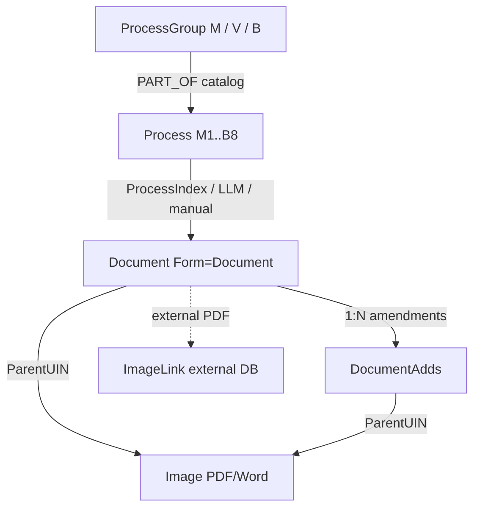

# Экспорт онтологии PDFtoBPMN v2.1 для внешнего сопоставления

**Назначение:** схема для сопоставления с моделью «Регламентирующие документы» Directum RX 25.3.  
**Версия:** PDFtoBPMN v2.1 / GraphRAG  
**Источник граф-якоря:** РК01-2026-08 (карта процессов СМК), канонический срез — `ontology_anchor.yaml` (плановый SSOT; в репозитории воспроизведён из `qms_taxonomy` / `webBI/qms-process-map.html`)  
**Дата экспорта:** 2026-05-19  
**Ограничения:** без текстов нормативных документов, без PII, без внутренних URL.

---

## §1. Граф-якорь (ProcessGroup → Process → SubProcess → Owner)

Скелет графа до обработки документов: **3** группы + **14** процессов + **21** подпроцесс (узлы skeleton) + **12** владельцев. Связи: `PART_OF` (иерархия), `OWNER` (процесс/подпроцесс → владелец).

### 1.1. Группы процессов (3)

| Код | Название |
|-----|----------|
| `М` | Процессы менеджмента |
| `В` | Процессы обеспечения |
| `Б` | Производственные (основные) процессы |

### 1.2. Процессы (14)

| Код | Название | Группа |
|-----|----------|--------|
| `М1` | Анализ и оценка | `М` |
| `М2` | Планирование качества | `М` |
| `В1` | Управление транспортной безопасностью | `В` |
| `В2` | Управление безопасностью полётов | `В` |
| `В4` | Управление персоналом | `В` |
| `В5` | Управление инфраструктурой | `В` |
| `В6` | Поддержание лётной годности, ТО ВС | `В` |
| `В7` | Управление охраной труда | `В` |
| `В8` | Экологический менеджмент | `В` |
| `Б1` | Организация коммерческих воздушных перевозок | `Б` |
| `Б5` | Взаимодействие с потребителями | `Б` |
| `Б6` | Планирование и бюджетирование | `Б` |
| `Б7` | Управление закупками | `Б` |
| `Б8` | Управление полётами | `Б` |

### 1.3. Подпроцессы (21)

Узлы skeleton по спецификации anchor (3+14+21=38 узлов каталога процессов). Имена — из РК01-2026-08; для процессов без декомпозиции в РК в классификаторе подпроцесс приравнивается имени процесса, но в skeleton выделяется **один** узел на процесс.

| ID | Код | Название подпроцесса | Процесс | Владелец (см. §1.4) |
|----|-----|----------------------|---------|---------------------|
| `SP-M1-01` | `М1` | Мониторинг, измерение | `М1` | `OWNER-01` |
| `SP-M1-02` | `М1` | Постоянное улучшение | `М1` | `OWNER-01` |
| `SP-M1-03` | `М1` | Внутренний аудит | `М1` | `OWNER-01` |
| `SP-M1-04` | `М1` | Анализ со стороны руководства | `М1` | `OWNER-01` |
| `SP-M2-01` | `М2` | Анализ СМК высшим руководством | `М2` | `OWNER-02` |
| `SP-M2-02` | `М2` | Планирование изменений и развитие СМК | `М2` | `OWNER-02` |
| `SP-M2-03` | `М2` | Определение политики и целей в области качества | `М2` | `OWNER-02` |
| `SP-M2-04` | `М2` | Установление показателей деятельности в процессах | `М2` | `OWNER-02` |
| `SP-V1-01` | `В1` | Управление транспортной безопасностью | `В1` | `OWNER-03` |
| `SP-V2-01` | `В2` | Управление безопасностью полётов | `В2` | `OWNER-04` |
| `SP-V4-01` | `В4` | Управление персоналом | `В4` | `OWNER-05` |
| `SP-V5-01` | `В5` | Учёт и управление имуществом | `В5` | `OWNER-11` |
| `SP-V5-02` | `В5` | Технические и программные средства, ИКТ | `В5` | `OWNER-12` |
| `SP-V5-03` | `В5` | Управление информационной безопасностью | `В5` | `OWNER-10` |
| `SP-V6-01` | `В6` | Поддержание лётной годности, ТО ВС | `В6` | `OWNER-03` |
| `SP-B1-01` | `Б1` | Организация перевозки на самолётах | `Б1` | `OWNER-13` |
| `SP-B1-02` | `Б1` | Организация наземного обслуживания ВС, вкл. ПОО | `Б1` | `OWNER-14` |
| `SP-B1-03` | `Б1` | Организация сервисного обеспечения | `Б1` | `OWNER-15` |
| `SP-B1-04` | `Б1` | Производство полётов | `Б1` | **(гэп: owner undefined)** |
| `SP-B8-01` | `Б8` | Оперативное управление полётами | `Б8` | `OWNER-03` |
| `SP-B8-02` | `Б8` | Аэронавигационное обеспечение полётов | `Б8` | `OWNER-03` |

**Примечание для ревьюера:** в публикуемой карте СМК (`qms-process-map`) явно перечислено **17** именованных подпроцессов (у `М1`, `М2`, `В5`, `Б1`, `Б8`). В skeleton anchor ещё **4** узла — по одному на процессы `В1`, `В2`, `В4`, `В6` (в РК декомпозиция не приведена; узел = имя процесса). Процессы `В7`, `В8`, `Б5`, `Б6`, `Б7` в skeleton **без** отдельного SubProcess-узла (классификация документов — на уровне Process). Итого **21** SubProcess-узел.

### 1.4. Владельцы (12 + вне anchor)

Обезличенные ID. Текст должности — тип роли из оргструктуры РК, **без ФИО**.

| ID | Роль / должность (обобщённо) |
|----|------------------------------|
| `OWNER-01` | Заместитель генерального директора — директор по внутреннему контролю |
| `OWNER-02` | Генеральный директор |
| `OWNER-03` | Заместитель генерального директора — старший операционный директор |
| `OWNER-04` | Заместитель генерального директора — директор по управлению безопасностью полётов |
| `OWNER-05` | Заместитель генерального директора — директор по персоналу |
| `OWNER-06` | Коллегиальный орган по закупкам |
| `OWNER-07` | Вице-президент по экономике (дочернее общество) |
| `OWNER-08` | Президент дочернего общества пассажирских перевозок |
| `OWNER-09` | Заместитель генерального директора — финансовый директор |
| `OWNER-10` | Начальник управления корпоративной безопасности |
| `OWNER-11` | Заместитель генерального директора — директор по эксплуатации наземных сооружений |
| `OWNER-12` | Начальник управления эксплуатации ИТ (дочернее ИТ-подразделение) |

**Владельцы подпроцессов вне списка 12** (только на уровне подпроцесса, не дублируются в anchor Owner-nodes):

| ID | Роль (только подпроцесс) |
|----|---------------------------|
| `OWNER-13` | Лётный директор |
| `OWNER-14` | Руководитель департамента наземного обслуживания |
| `OWNER-15` | Вице-президент по сервису (дочернее общество) |

### 1.5. Явные гэпы

| Узел | Гэп |
|------|-----|
| `SP-B1-04` (`Б1` подпроцесс «Производство полётов») | **owner undefined** — в матрице РК01-2026-08 владелец не назначен (п. 4.4.2.3) |
| `В3` | **(нет в источнике)** — в РК01-2026-08 нет процесса с кодом `В3` |
| Карточка согласования НД | **(нет в источнике)** — связь `Document` → карточка согласования в Domino API не экспонируется |

**Счётчики §1:** групп **3**, процессов **14**, подпроцессов skeleton **21**, владельцев anchor **12**, гэпов **≥3** (см. таблицу).

---

## §2. Типизированные артефакты Фазы 3 (13 типов)

Источник: `core/knowledge_types.py`, `docs/Architecture_v2.1.md` §3, `.cursor/agents/extractor.md`.  
Обёртка: `KnowledgeArtifact` + `Provenance` (dataclass; в pipeline — JSON, валидируется схемой).

### 2.0. Общие поля

| Поле | Тип | Смысл |
|------|-----|--------|
| `id` | `string` | Уникальный идентификатор артефакта в графе |
| `type` | `KnowledgeType` | Один из 13 типов ниже |
| `content` | `object` | Поля, специфичные для типа |
| `provenance` | `Provenance` | Трассировка к источнику |
| `relations` | `array<object>` | Связи с другими артефактами (опционально) |

**Provenance**

| Поле | Тип | Смысл |
|------|-----|--------|
| `document_code` | `string` | Код документа-источника |
| `document_version` | `string` | Редакция / номер изменения |
| `section` | `string` | Раздел / пункт |
| `page` | `integer` | Номер страницы |
| `paragraph` | `string` \| `null` | Абзац / подпункт |
| `document_authority` | `string` | `canonical` \| `superseded` \| `draft` |
| `extraction_method` | `string` | `rule_based` \| `llm_based` \| `manual` |
| `confidence` | `float` | 0.0–1.0 |

**Метод извлечения по типам**

| Метод | Типы |
|-------|------|
| Rule-based | `definition`, `abbreviation`, `document_ref`, `formula`, `form_template` |
| LLM-based | `role`, `process_step`, `decision_rule`, `kpi`, `control`, `input_output` |
| Смешанный / seed | `org_unit`, `system` (текст + нормализация к справочнику) |

### 2.1. Типы (13)

#### `Definition` — class enum value `definition`

Определение термина в теле документа.

| Поле `content` | Тип | Смысл |
|----------------|-----|--------|
| `term` | `string` | Термин |
| `definition` | `string` | Определение |
| `scope` | `string` | Область применения в документе |

#### `Abbreviation` — `abbreviation`

Сокращение и расшифровка.

| Поле | Тип | Смысл |
|------|-----|--------|
| `abbreviation` | `string` | Сокращение |
| `expansion` | `string` | Расшифровка |

#### `DocumentRef` — `document_ref`

Ссылка на другой нормативный документ.

| Поле | Тип | Смысл |
|------|-----|--------|
| `target_code` | `string` | Код целевого документа |
| `target_title` | `string` | Наименование (если указано) |
| `context` | `string` | Контекст ссылки |
| `relationship` | `string` | `extends` \| `references` \| `supersedes` \| `conflicts` |

#### `Formula` — `formula`

Формула или расчётное правило.

| Поле | Тип | Смысл |
|------|-----|--------|
| `expression` | `string` | Выражение |
| `variables` | `array<string>` | Переменные |
| `description` | `string` | Текстовое описание |

#### `FormTemplate` — `form_template`

Форма или шаблон из приложения.

| Поле | Тип | Смысл |
|------|-----|--------|
| `name` | `string` | Наименование формы |
| `template_id` | `string` | Идентификатор (если есть) |
| `appendix_ref` | `string` | Ссылка на приложение |

#### `Role` — `role`

Должностная роль в процессе (из RACI / текста процедуры).

| Поле | Тип | Смысл |
|------|-----|--------|
| `name` | `string` | Наименование роли |
| `department` | `string` | Подразделение |
| `responsibilities` | `array<string>` | Зона ответственности |
| `raci_pattern` | `string` | Типичный RACI-паттерн (опционально) |

#### `OrgUnit` — `org_unit`

Организационное подразделение.

| Поле | Тип | Смысл |
|------|-----|--------|
| `name` | `string` | Наименование |
| `org_type` | `string` | Тип узла оргструктуры |
| `parent` | `string` | Вышестоящее подразделение (если извлечено) |

#### `System` — `system`

Информационная система или модуль.

| Поле | Тип | Смысл |
|------|-----|--------|
| `name` | `string` | Наименование ИС |
| `sw_type` | `string` | `system` \| `module` |

#### `ProcessStep` — `process_step`

Шаг процедуры / процесса.

| Поле | Тип | Смысл |
|------|-----|--------|
| `name` | `string` | Действие (глагол + объект) |
| `executor` | `string` | Исполнитель (роль) |
| `inputs` | `array<string>` | Входы |
| `outputs` | `array<string>` | Выходы |
| `sequence_number` | `integer` | Порядковый номер (опционально) |

#### `DecisionRule` — `decision_rule`

Условие ветвления.

| Поле | Тип | Смысл |
|------|-----|--------|
| `condition` | `string` | Условие |
| `if_true` | `string` | Действие при истине |
| `if_false` | `string` | Действие при ложности |
| `gateway_type` | `string` | `exclusive` \| `parallel` \| `inclusive` |

#### `KPI` — `kpi`

Показатель эффективности.

| Поле | Тип | Смысл |
|------|-----|--------|
| `name` | `string` | Наименование показателя |
| `formula` | `string` | Формула расчёта |
| `target_value` | `string` | Целевое значение |
| `measurement_unit` | `string` | Единица измерения |
| `frequency` | `string` | Периодичность |
| `owner_role` | `string` | Ссылка на роль-владельца KPI |

#### `Control` — `control`

Контрольная процедура.

| Поле | Тип | Смысл |
|------|-----|--------|
| `name` | `string` | Наименование контроля |
| `description` | `string` | Описание проверки |
| `frequency` | `string` | Периодичность (опционально) |

#### `InputOutput` — `input_output`

Вход или выход процесса.

| Поле | Тип | Смысл |
|------|-----|--------|
| `name` | `string` | Наименование объекта |
| `io_type` | `string` | `input` \| `output` |
| `medium` | `string` | `document` \| `data` \| `system` |

**Счётчик §2:** типов артефактов **13**.

---

## §3. Структура БНД через публикацию `qms-process-map`

Источники: `webBI/qms-process-map.html`, `webBI/doc-catalog.json`, `lotus-mcp/build_doc_catalog.py`, `docs/DOMINO_KEEP_API.md`.  
Domino: база `dflib.nsf`, scope `dflib` (Библиотека нормативных документов).

### 3.1. Публикуемые сущности и связи

| Сущность | Где в UI | Ключ связи |
|----------|----------|------------|
| Группа / процесс СМК | Табы «Обзор», «Подпроцессы»; справочник `docProcesses` | Код `M1`…`B8` (латиница в JSON) |
| Документ НД | Таб «Документы» | `num`, привязка к `process` |
| Изменение | Раскрытие «N изм.» | `amendments[]` |
| Части составного документа | «развернуть» части | `files[]` (>1 PDF) |
| Файл PDF | Кнопки PDF | `files[].url` → прокси `/api/domino-file/{UNID}` |
| Файл Word | Кнопки Word | `word_files[].unid` |
| Карточка Lotus | Ссылка Lotus | `notes_url` (схема Notes, хост обезличен в §3.4) |

**Маршрут публикации:** `GET /info/qms-process-map` → HTML; `GET /doc-catalog.json` → фид документов.

### 3.2. Поля карточки документа (Domino → JSON)

**Form = `Document` (основная карточка)**

| Поле Domino | Тип | Смысл |
|-------------|-----|--------|
| `meta.unid` | `string` | UNID карточки (ключ API с префиксом meta) |
| `Form` | `string` | `Document` |
| `DocNum` | `string` | Регистрационный номер |
| `DocSubject` | `string` | Наименование |
| `DocDate` | `date` | Дата введения |
| `DocDateActual` | `date` | Дата актуальности |
| `DocStatus` | `string` | Статус жизненного цикла |
| `ProcessIndex` | `string` | Код процесса СМК |
| `ProcessName` | `string` | Название процесса |
| `DocOsnov` | `string` | Документ-основание (приказ) |
| `DocExecutorSNM` | `string` | Разработчик (персоналия; **не публикуется в фид**) |
| `DocMainDepartmentName` | `string` | Директорат-владелец |

**Form = `DocumentAdds` (изменение)**

| Поле | Тип | Смысл |
|------|-----|--------|
| `meta.unid` | `string` | UNID карточки изменения (ключ API с префиксом meta) |
| `Form` | `string` | `DocumentAdds` |
| `DocNum` | `string` | Номер основного документа |
| `DocNumIzm` | `string` | Номер изменения |
| `DocDate` | `date` | Дата изменения |
| `ProcessIndex` | `string` | Процесс (fallback классификации) |

**Form = `Image` (вложение)**

| Поле | Тип | Смысл |
|------|-----|--------|
| `unid` | `string` | UNID файла (ключ API) |
| `ParentUIN` | `string` | UNID родительской карточки |
| `$13` / `DocSign` | `string` | Статус файла |
| `$14` / `DocSubject` | `string` | Описание файла |

**Form = `ImageLink`**

| Поле | Тип | Смысл |
|------|-----|--------|
| — | — | Ссылка на внешнюю базу; в KEEP **403**, обход через `EXTERNAL_PDF` в сборщике |

**Поля записи в `doc-catalog.json` (публичный фид)**

| Поле JSON | Тип | Смысл |
|-----------|-----|--------|
| `num` | `string` | Номер НД |
| `title` | `string` | Наименование |
| `url` | `string` | UNID или URL первого PDF |
| `web_url` | `string` | HTTP OpenDocument (хост → `<internal_host>`) |
| `notes_url` | `string` | Notes-ссылка |
| `files` | `array` | Части / PDF (`name`, `url`, `ds?`) |
| `date` | `string` | ISO-дата |
| `changes` | `integer` | Число изменений |
| `type` | `string` | Тип документа (классификатор БНД) |
| `department` | `string` | Подразделение |
| `process_name` | `string` | Название процесса |
| `word_files` | `array` | Word-вложения (`unid`, `name`) |
| `amendments` | `array` | Изменения (`date`, `izm`, `notes_url`, `word_files`, `pdf_files`) |
| `auto` | `boolean` | `true` — процесс присвоен LLM, не из `ProcessIndex` |

### 3.3. Состояния документа и файла

| Объект | Поле | Значения (из справочника API) |
|--------|------|-------------------------------|
| Карточка НД | `DocStatus` | `Действующий` (основное для каталога) |
| Файл-вложение | `$13` / `DocSign` | `Действующий`, `Проект`, `Согласован ОДО` |
| View-фильтр каталога | `(DocumentByNumberForAll)` | Действующие по номеру |

Полный перечень статусов жизненного цикла карточки: **(нет в источнике)** — в эксплуатационном контуре зафиксирован только `Действующий`.

### 3.4. Связи между документами

| Связь | Механизм | Поля |
|-------|----------|------|
| Редакции / изменения | Дочерние `DocumentAdds` | `DocNum` + `DocNumIzm`, поле index иерархии |
| Основание введения | Реквизит карточки | `DocOsnov` |
| Составной документ | Несколько PDF одного `DocNum` | `files[]` |
| Эталон / печать | `v_ImagesForDocPrint` | `ParentUIN` |
| Word проект | `v_ImagesForDoc` + `category=UNID` | `ParentUIN`, фильтр `$13` |
| Отмена / замена | **(нет в источнике)** | Явного поля «отменяет» в API не описано |
| Приложения | Части в `files[]` или Image | `name`, многочастность |
| Внешняя база | `ImageLink` / `EXTERNAL_PDF` | `ds` + UNID в другом dataSource |

**Прокси файлов:** `GET /api/domino-file/{unid}?ds=` — бэкенд портала; исходный Domino — `<internal_host>`.

### 3.5. Классификация документ → процесс

Приоритет (`build_doc_catalog.py`):

1. `MANUAL_OVERRIDES`
2. `ProcessIndex` из `DocumentAdds` (последнее изменение)
3. `ProcessIndex` из `Document`
4. Поле `$15` из `(DocumentByProcess)`
5. LLM-классификация (`auto: true`)

---

## §4. Роли

### 4.1. Роли на карточке БНД (справочник Domino)

| Роль / реквизит | Поле | В фиде портала |
|-----------------|------|----------------|
| Разработчик документа | `DocExecutorSNM` | Нет (PII) |
| Директорат-владелец | `DocMainDepartmentName` | Да (`department`) |
| Согласующие / утверждающие | **(нет в источнике)** | Карточка согласования не доступна через KEEP |
| RACI-роли на карточке | **(нет в источнике)** | Отдельного справочника ролей в API БНД нет |

### 4.2. Роли, извлекаемые из текста НД (PDFtoBPMN Phase 3)

Тип артефакта `role` — должности и зоны ответственности **внутри процедур** (не путать с `OWNER-*` граф-якоря).

### 4.3. Роли в графе знаний (BPMN / RACI views)

Рёбра `has_role` (`core/edge_types.py` + онтология графа):  
`owner`, `executor`, `analyst`, `approver`, `consulted`, `informed`.

RACI-рёбра: `responsible_for`, `accountable_for`, `consulted_in`, `informed_of`.

### 4.4. Итог для сопоставления с Directum RX

| Контур | Роли |
|--------|------|
| Карточка БНД (Domino) | Только реквизиты разработчика и директората; **формальный справочник ролей документа — (нет в источнике)** |
| PDFtoBPMN extraction | `Role` + RACI-рёбра из текста |
| СМК anchor | 12 (+3) обезличенных `OWNER-*` |

---

## Приложение A. Счётчики для H9 / Validator

| Метрика | Значение |
|---------|----------|
| Группы процессов | 3 |
| Процессы | 14 |
| Подпроцессы (skeleton) | 21 |
| Владельцы anchor | 12 |
| Типы артефактов Phase 3 | 13 |
| Явные гэпы (минимум) | 3 (`Б1г`, `В3`, карточка согласования) |

## Приложение B. Входы pre-gate (наличие)

| # | Вход | Статус |
|---|------|--------|
| 1 | `ontology_anchor.yaml` | Логический SSOT; содержимое §1 воспроизведено из `qms_taxonomy` / РК01-2026-08 |
| 2 | 13 типов Phase 3 | `core/knowledge_types.py`, Architecture §3 |
| 3 | qms-process-map + `doc-catalog.json` | `todo/webBI/` |
| 4 | SKILL / API БНД | `docs/DOMINO_KEEP_API.md`, `build_doc_catalog.py` |

---

*Документ подготовлен для внешнего ревью. Не содержит цитат из нормативных документов и персональных данных.*
