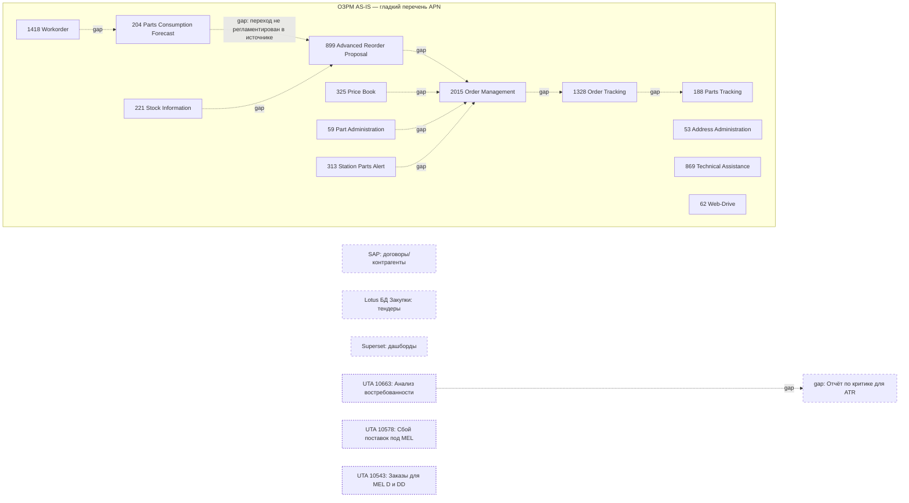
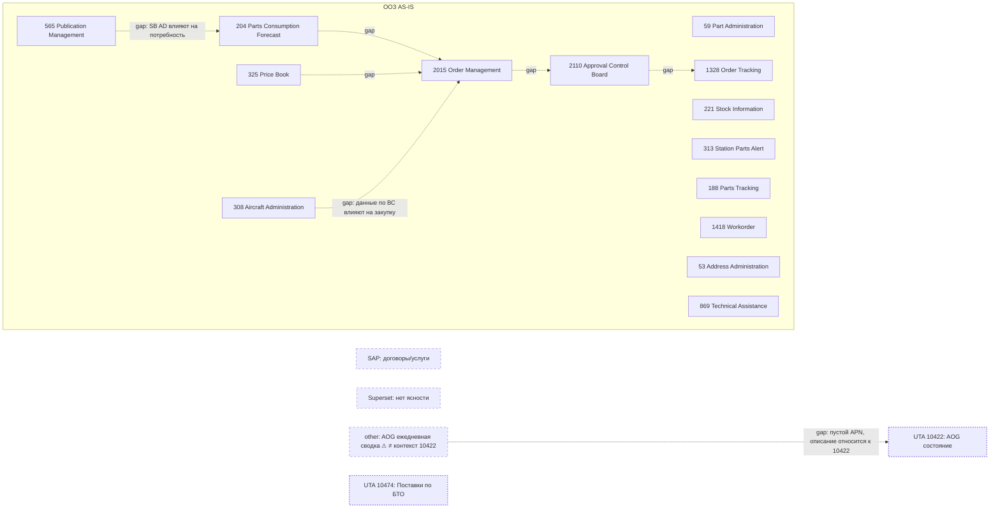
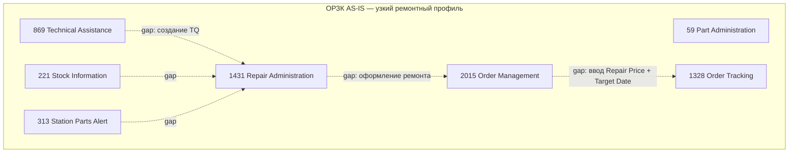
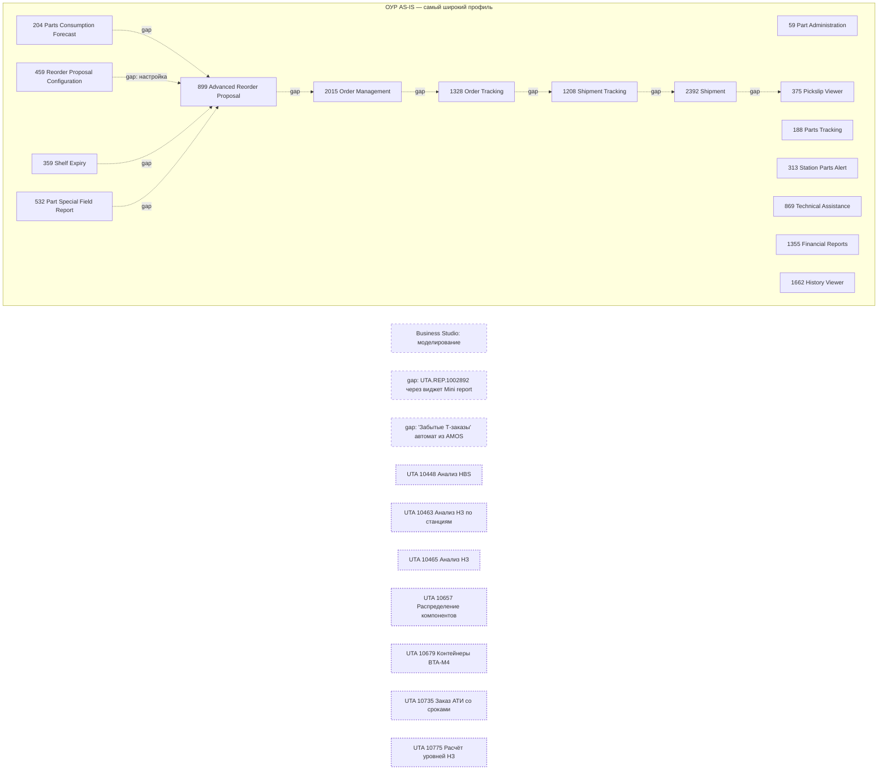
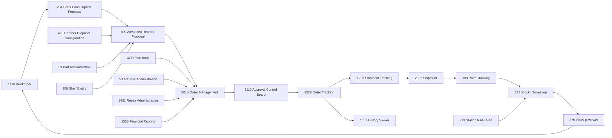

# AMOS APN Usage Analytics — итерация 1 (AS-IS, UTair)

> **Версия**: v1, 2026-05-06. Картина строго AS-IS. Разрывы источника обозначены явно (Rule 0).
> **Источник истины**: 3 xlsx из [`input2/AMOS/APN_usage/`](../../input2/AMOS/APN_usage) + WebUI Guide `/home/budnik_an/todo/webBI/amos-help/` + Swiss-AS PDF `/home/budnik_an/todo/unpublished/amos-pdf-en/`.
> **Снимок данных**: [`poc/amos_apn_enriched.json`](../../poc/amos_apn_enriched.json), сгенерирован [`poc/amos_apn_mapper.py`](../../poc/amos_apn_mapper.py).

## 1. Executive summary

| Показатель | Значение |
|---|---:|
| Всего строк в xlsx «APN по отделам» | 72 |
| Отделов в источнике | **4** (ОЗРМ, ООЗ, ОРЗК, ОУР) |
| Строк, классифицированных как штатный AMOS APN | 50 |
| Уникальных APN AMOS, фактически используемых | **25** |
| Строк, классифицированных как кастомный отчёт `UTA.REP.*` | 12 |
| Уникальных `UTA.REP.*` отчётов | 12 |
| Строк, ссылающихся на не-AMOS системы (SAP, Lotus, Superset, Business Studio) | 6 |
| Строк-разрывов источника (`gap_no_apn`, `other`) | 4 |
| Покрытие AMOS Guide (HTM `APN<NNNN>.htm`) для использованных APN | **25 / 25 (100 %)** |
| Покрытие AMOS Guide (PDF Swiss-AS) для использованных APN | **25 / 25 (100 %)** |

**Ключевые наблюдения первичной аналитики:**

1. Используется **25 из 940** доступных штатных APN AMOS — это ~2,7 % каталога. Это нормально для отдельного функционального блока (снабжение), но даёт **большое поле для расширения**: ряд reference-шагов закрыт `UTA.REP.*` отчётами, а не штатным модулем.
2. Все 25 используемых APN имеют документацию и в WebUI-помощнике, и в оригинальных PDF Swiss-AS — то есть для каждого AS-IS-инструмента есть верифицируемый reference.
3. **Источник не описывает порядок шагов между APN внутри отдела** — это разрыв источника по Rule 0. Любая «процессная цепочка» в этом отчёте — формальное группирование, а не регламент.
4. **Перекрывающееся использование одного APN разными отделами с разной семантикой** — 4 отдела используют `2015 Order Management`, `1328 Order Tracking`, `869 Technical Assistance`, `313 Station Parts Alert` — но в усердий каждого отдела ярлык «зачем» отличается (см. раздел 7).
5. **Кандидаты на TO-BE без рекомендации**: 12 кастомных отчётов `UTA.REP.*` дублируют функции, для которых в AMOS есть штатные модули (`Stock Statistics`, `Purchase Report`, `Inventory Differences Report`, `Aircraft Status Report`, `Order Report Data Sources`) — но мы только фиксируем дельту, не предписываем миграцию.

## 2. Карта APN × отдел (AS-IS)

Сокращения отделов:

- **ОЗРМ** — Отдел закупок расходных материалов (руководитель — Ситникова Е.С.)
- **ООЗ** — Отдел оперативных закупок (руководитель — Катермин Б.Б.)
- **ОРЗК** — Отдел ремонтов и закупок компонентов (руководитель `⚠ GAP — не указан в xlsx`)
- **ОУР** — Отдел управления ресурсами (руководитель `⚠ GAP — не указан в xlsx`)

Колонки: 1 — APN использует отдел, пусто — нет упоминания в источнике (Rule 0: трактуется как `gap-source`, не как «не нужен»).

### 2.1. Штатные модули AMOS

| APN | Название (EN) | Назначение по AMOS Guide (краткое) | ОЗРМ | ООЗ | ОРЗК | ОУР |
|---:|---|---|:---:|:---:|:---:|:---:|
| 53 | Address Administration | Управление адресами и контрагентами | 1 | 1 |  |  |
| 59 | Part Administration | Реестр номеров деталей, статусов, альтернатив | 1 | 1 | 1 | 1 |
| 62 | Web-Drive | Веб-доступ к AMOS-серверу (онлайн-хранилище) | 1 |  |  |  |
| 188 | Parts Tracking | История перемещений деталей и их альтернатив | 1 | 1 |  | 1 |
| 204 | Parts Consumption Forecast | Прогноз потребности под текущие/будущие работы | 1 | 1 |  | 1 |
| 221 | Stock Information | Системные остатки на складах/базах | 1 | 1 | 1 |  |
| 308 | Aircraft Administration | Реестр и данные о ВС |  | 1 |  |  |
| 313 | Station Parts Alert | Запросы запчастей между станциями | 1 | 1 | 1 | 1 |
| 325 | Price Book | Прайс-лист, условия поставщиков, сроки и цены | 1 | 1 |  |  |
| 359 | Shelf Expiry | Контроль срока хранения вращаемых и расходных |  |  |  | 1 |
| 375 | Pickslip Viewer | Поиск и отображение pickslip |  |  |  | 1 |
| 459 | Reorder Proposal Configuration | Настройка автозаказа |  |  |  | 1 |
| 532 | Part Special Field Report | Отчёт по деталям с NoGo / PRIO |  |  |  | 1 |
| 565 | Publication Management | Управление техдокументацией (SB, AD) |  | 1 |  |  |
| 869 | Technical Assistance | Сбор/отслеживание технических вопросов (форма U240) | 1 | 1 | 1 | 1 |
| 899 | Advanced Reorder Proposal | Заказ для НЗ расходных и потребляемых деталей | 1 |  |  | 1 |
| 1208 | Shipment Tracking | Обзор отгрузок с фильтрами |  |  |  | 1 |
| 1328 | Order Tracking | Сбор информации по разным типам заказов | 1 | 1 | 1 | 1 |
| 1355 | Financial Reports | Финансовые отчёты (consumption, открытые заказы и др.) |  |  |  | 1 |
| 1418 | Workorder | Работа с aircraft / component work orders | 1 | 1 |  |  |
| 1431 | Repair Administration | Заказы на ремонт |  |  | 1 |  |
| 1662 | History Viewer | Общая история событий по типам документов |  |  |  | 1 |
| 2015 | Order Management | Создание/обработка заказов всех типов | 1 | 1 | 1 | 1 |
| 2110 | Approval Control Board | Просмотр/контроль/редактирование запросов на одобрение |  | 1 |  |  |
| 2392 | Shipment | Администрирование отгружаемого/отгруженного материала |  |  |  | 1 |

**Итого по отделам**:

- ОЗРМ — 13 штатных APN (ядро закупочного контура)
- ООЗ — 14 штатных APN (закупочный контур + ВС-данные + согласования)
- ОРЗК — 7 штатных APN (узкий ремонтный профиль)
- ОУР — 16 штатных APN (планирование/НЗ/отгрузки/история — самый широкий профиль)

### 2.2. Кастомные отчёты `UTA.REP.*` (не Swiss-AS, надстройка UTair)

| APN | Report ID | Описание (из usage_note) | Отдел |
|---:|---|---|---|
| 10422 | UTA.REP.1003174 | AOG состояние | ООЗ |
| 10448 | UTA.REP.1002798 | Анализ HBS | ОУР |
| 10463 | UTA.REP.1002854 | Анализ НЗ по станциям | ОУР |
| 10465 | UTA.REP.1002722 | Анализ НЗ | ОУР |
| 10474 | UTA.REP.1002734 | Поставки по БТО (ежедневный по будням) | ООЗ |
| 10543 | UTA.REP.1003284 | Заказы для MEL D и DD | ОЗРМ |
| 10578 | UTA.REP.1003387 | Сбой поставок под MEL | ОЗРМ |
| 10657 | UTA.REP.1003548 | Распределение компонентов | ОУР |
| 10663 | UTA.REP.1003558 | Анализ востребованности компонентов | ОЗРМ |
| 10679 | UTA.REP.1003593 | Распределение контейнеров BTA-M4 | ОУР |
| 10735 | UTA.REP.1003853 | Заказ АТИ со сроками годности | ОУР |
| 10775 | UTA.REP.1003975 | Расчёт уровней НЗ | ОУР |

Это **доработки UTair**, реализованные как mini-report в AMOS. Для них **не существует** vendor-guide-документации — сравнение с Guide невозможно (`n/a`). Сравнение с best practices — возможно (см. раздел 5).

### 2.3. Не-AMOS источники и разрывы

| Тип | Отдел | Назначение в источнике | Причина исключения |
|---|---|---|---|
| SAP | ОЗРМ | Просмотр договоров и квалификации контрагентов | внешняя ERP, **out of AMOS scope** |
| SAP | ООЗ | Часть договоров, согласование услуг (нач. отдела) | внешняя ERP |
| Lotus Notes («БД Закупки») | ОЗРМ | Тендеры/протоколы | внешний справочник, **out of AMOS scope** |
| Superset | ОЗРМ, ООЗ | Дашборды (по словам источника, «некоторые отчёты делает Е. Кармазин») | BI-надстройка, **out of AMOS scope** |
| Business Studio | ОУР | Business Studio | моделирование процессов, **out of AMOS scope** |
| `сборный отчёт` без APN | ОЗРМ | «Отчёт по критике для ATR» — собирается из 10663 + наличие/заказы | **`⚠ GAP no_apn`** — нет программной точки в AMOS, ручной agregation |
| `Автомат из AMOS` без APN | ОУР | «Забытые Т-заказы» | **`⚠ GAP no_apn`** — автоматизация без идентифицированного APN |
| `через виджет Mini report` без APN | ОУР | UTA.REP.1002892 — наполненность HBS критичной номенклатуры | **`⚠ GAP no_apn`** — отчёт виден через виджет, не через штатный APN |
| Пустой APN, текст в колонке Name | ООЗ | «ежедневное состояние заказов для AOG (10422), коротких MEL и др. срочных задач» | `≠ контекст` — мета-комментарий о UTA.REP.10422, а не отдельная позиция |

## 3. Процессная цепочка снабжения AS-IS (по отделам)

> **Rule 0 — критическое предупреждение**: в источнике (xlsx «APN по отделам») **отсутствует колонка регламентированного порядка шагов**. Стрелки на диаграммах ниже **штрихованные** и означают только «сгруппированный список инструментов отдела», а не процессный sequenceFlow. Для построения настоящего sequenceFlow требуется отдельный регламент (ДП/процедура), которого в этой выгрузке нет.

### 3.1. ОЗРМ (Отдел закупок расходных материалов)

**Что зафиксировано из источника**:
- 13 штатных AMOS APN покрывают полный закупочный контур: P/N → прайс → потребность → НЗ → заказ → трекинг → склад.
- 3 кастомных UTA-отчёта (анализ востребованности, сбой поставок, заказы под MEL D/DD) — все сосредоточены на критическом MEL/AOG-классе.
- 4 не-AMOS точки: SAP (договоры), Lotus (тендеры), Superset (дашборды), сборный отчёт по критике ATR — это **разрывы AMOS-замкнутости** контура.

### 3.2. ООЗ (Отдел оперативных закупок)

**Что зафиксировано из источника**:
- 14 штатных APN, **уникально для UTair**: подключены `565 Publication Management` (отслеживание SB/AD как драйвера закупок), `308 Aircraft Administration` (привязка к конкретному ВС), `2110 Approval Control Board` (согласования на стороне закупок).
- 2 кастомных отчёта целиком на оперативной критике (AOG, БТО).
- Разрыв: одна строка имеет пустой APN, но текст в колонке Name описывает ежедневную сводку AOG — это **мета-комментарий**, а не отдельная программная точка.

### 3.3. ОРЗК (Отдел ремонтов и закупок компонентов)

**Что зафиксировано из источника**:
- Самый компактный профиль — 7 штатных APN, без UTA-отчётов, без не-AMOS источников.
- Ось процесса: `1431 Repair Administration → 2015 Order Management → 1328 Order Tracking`. Это единственный отдел, где usage_note **косвенно намекает на порядок** (через слова «вкладывает квотацию в заказ на ремонт»), но это всё равно описание, а не регламент — sequenceFlow остаётся со штампом `gap`.
- Отсутствует Price Book (325) — потенциальный разрыв с Reference (раздел 4) либо это покрывается через AMOS-неуказанным каналом / SAP / телефонную коммуникацию (источник не уточняет).

### 3.4. ОУР (Отдел управления ресурсами)

**Что зафиксировано из источника**:
- 16 штатных APN — самый широкий профиль среди 4 отделов: единственный отдел, использующий `459 Reorder Proposal Configuration`, `375 Pickslip Viewer`, `532 Part Special Field Report`, `1208 Shipment Tracking`, `2392 Shipment`, `1355 Financial Reports`, `1662 History Viewer`, `359 Shelf Expiry`.
- 7 кастомных UTA-отчётов — фактически весь HBS/НЗ-аналитический контур держится на UTair-надстройках.
- 3 разрыва: «Забытые T-заказы» (автомат без APN), отчёт через виджет Mini report (UTA.REP.1002892 без APN-кода), Business Studio (out of scope).

## 4. Reference-цепочка procurement по AMOS Guide

Канонический материальный поток procurement в AMOS, восстановленный по WebUI-помощнику UTair. Каждая нода — ссылка на HTM-страницу + цитата из «Обзор/Overview» этого APN.

**Цитаты из AMOS Guide (Overview-страницы)**, для верификации reference-цепочки:

- **204 Parts Consumption Forecast** ([`APN0204.htm`](file:///home/budnik_an/todo/webBI/amos-help/APN0204.htm) → Overview `28586.htm`) — *«Прогноз потребления деталей является одним из самых важных инструментов для закупщиков компании, так как информирует о всех деталях, которые потребуются для текущих и будущих мероприятий по техническому обслуживанию.»*
- **899 Advanced Reorder Proposal** ([`APN0899.htm`](file:///home/budnik_an/todo/webBI/amos-help/APN0899.htm) → Overview `27882.htm`) — *«Advanced Reorder Proposal is one of the main tools for material buyers and is used to ensure that adequate stock levels for consumable and expendable parts are held in the stores. The Reorder levels are set up with part number in Part Administration.»*
- **459 Reorder Proposal Configuration** ([`APN0459.htm`](file:///home/budnik_an/todo/webBI/amos-help/APN0459.htm) → Overview `27905.htm`) — *«Конфигурация предложения повторного заказа предварительно настроена с настройками по умолчанию. Однако возможно настроить данные так, чтобы они соответствовали требованиям компании и регуляторов.»*
- **2015 Order Management** ([`APN2015.htm`](file:///home/budnik_an/todo/webBI/amos-help/APN2015.htm) → Overview `29937.htm`) — *«Управление заказами является основным инструментом для создания и обработки всех типов заказов в AMOS. Заказы могут быть созданы вручную в этой программе или информация о заказе перенимается из других программ AMOS, например, Администрирование ремонта.»*
- **2110 Approval Control Board** ([`APN2110.htm`](file:///home/budnik_an/todo/webBI/amos-help/APN2110.htm) → Overview `32245.htm`) — *«Approval Control Board разработан так, чтобы вы могли просматривать, контролировать, отслеживать и редактировать существующие запросы на одобрение. Лицо, одобряющее определённое действие, информируется AMOS Mail.»*
- **1328 Order Tracking** ([`APN1328.htm`](file:///home/budnik_an/todo/webBI/amos-help/APN1328.htm) → Overview `24376.htm`) — *«Отслеживание заказов собирает всю соответствующую информацию о различных типах заказов.»*
- **1208 Shipment Tracking** ([`APN1208.htm`](file:///home/budnik_an/todo/webBI/amos-help/APN1208.htm) → Overview `25662.htm`) — *«Отслеживание отгрузок предоставляет вам подробный обзор всех отгрузок в AMOS.»*
- **2392 Shipment** ([`APN2392.htm`](file:///home/budnik_an/todo/webBI/amos-help/APN2392.htm) → Overview `43647.htm`) — *«Shipment администрирует весь материал, который необходимо отгрузить, или весь материал, который уже отгружен в вашей компании. Shipment не заменяет процесс получения товаров.»*
- **221 Stock Information** ([`APN0221.htm`](file:///home/budnik_an/todo/webBI/amos-help/APN0221.htm) → Overview `28215.htm`) — *«Системное количество должно отражать фактическое количество в запасе. Если каждое перемещение детали не зарегистрировано в/из склада корректно с помощью Pickslip Request и Pickslip Confirmation, фактическое количество в складе будет отличаться от системного количества.»*
- **313 Station Parts Alert** ([`APN0313.htm`](file:///home/budnik_an/todo/webBI/amos-help/APN0313.htm) → Overview `24807.htm`) — *«Эта программа в основном предназначена для запросов запчастей между внешними станциями.»*
- **375 Pickslip Viewer** ([`APN0375.htm`](file:///home/budnik_an/todo/webBI/amos-help/APN0375.htm) → Overview `23508.htm`) — *«Pickslip Viewer является важным инструментом для администрирования склада, он позволяет искать и отображать информацию о любых существующих pickslip в AMOS.»*
- **188 Parts Tracking** ([`APN0188.htm`](file:///home/budnik_an/todo/webBI/amos-help/APN0188.htm) → Overview `27992.htm`) — *«Отслеживание деталей отображает всю информацию о перемещениях в истории номеров деталей и их альтернатив.»*
- **1418 Workorder** ([`APN1418.htm`](file:///home/budnik_an/todo/webBI/amos-help/APN1418.htm) → Overview `55440.htm`) — *«Рабочие заявки играют центральную роль в AMOS. Существует два типа рабочих заявок, Aircraft или Компонент.»*
- **325 Price Book** ([`APN0325.htm`](file:///home/budnik_an/todo/webBI/amos-help/APN0325.htm) → Overview `24231.htm`) — *«Сотрудники отдела закупок могут сравнивать условия поставщиков, сроки поставки и цены, чтобы затем выбрать наиболее подходящий вариант.»*
- **53 Address Administration** ([`APN0053.htm`](file:///home/budnik_an/todo/webBI/amos-help/APN0053.htm) → Overview `22643.htm`) — *«Вы можете управлять адресами в Администрирование адресов.»*
- **59 Part Administration** ([`APN0059.htm`](file:///home/budnik_an/todo/webBI/amos-help/APN0059.htm) → Overview `25456.htm`) — *«Все номера деталей назначаются в Part Administration и являются уникальными в AMOS.»*
- **869 Technical Assistance** ([`APN0869.htm`](file:///home/budnik_an/todo/webBI/amos-help/APN0869.htm) → Overview `35858.htm`) — *«Техническая поддержка используется для сбора и отслеживания нескольких проблем в AMOS.»*
- **359 Shelf Expiry** ([`APN0359.htm`](file:///home/budnik_an/todo/webBI/amos-help/APN0359.htm) → Overview `23368.htm`) — *«Сотрудник склада может контролировать все вращаемые детали и расходные материалы с ограничением срока хранения в Срок хранения.»*
- **532 Part Special Field Report** ([`APN0532.htm`](file:///home/budnik_an/todo/webBI/amos-help/APN0532.htm) → Overview `24314.htm`) — *«Этот отчёт перечисляет все детали с NoGo или PRIO классификацией.»*
- **1662 History Viewer** ([`APN1662.htm`](file:///home/budnik_an/todo/webBI/amos-help/APN1662.htm) → Overview `34640.htm`) — *«History Viewer — это общая программа истории для ограниченного набора типов документов AMOS.»*
- **62 Web-Drive** ([`APN0062.htm`](file:///home/budnik_an/todo/webBI/amos-help/APN0062.htm) → Overview `35843.htm`) — *«Каждый сервер AMOS поставляется с интегрированным веб-сервером.»*
- **1431 Repair Administration** ([`APN1431.htm`](file:///home/budnik_an/todo/webBI/amos-help/APN1431.htm) → Overview `3295.htm`) — *«При открытии программы данные не отображаются, пока вы не введёте критерии фильтра и не нажмёте Поиск.»* (Overview документа фокусируется на UI; функциональное описание — в смежных страницах.)
- **308 Aircraft Administration** ([`APN0308.htm`](file:///home/budnik_an/todo/webBI/amos-help/APN0308.htm) → Overview `22595.htm`) — *«Aircraft Administration используется для ввода, просмотра или изменения данных обо всех самолетах компании.»*
- **565 Publication Management** ([`APN0565.htm`](file:///home/budnik_an/todo/webBI/amos-help/APN0565.htm) → Overview `22524.htm`) — *«Управление публикациями используется для следующего: …»*
- **1355 Financial Reports** ([`APN1355.htm`](file:///home/budnik_an/todo/webBI/amos-help/APN1355.htm) → Overview `22117.htm`) — *«Финансовые отчёты используется для создания различных отчётов, связанных с финансово значимыми показателями. Эти показатели всегда рассчитываются на основе средней цены деталей.»*

Соответствующие PDF Swiss-AS лежат в [`unpublished/amos-pdf-en/`](file:///home/budnik_an/todo/unpublished/amos-pdf-en) (например, `Order_Management.pdf`, `Order_Tracking.pdf`, `Stock_Information.pdf`, `Advanced_Reorder_Proposal.pdf`) и являются вторичным источником для тех же тем.

## 5. Best practices индустрии (для интерпретации, не предписание)

Тезисы взяты из открытых источников. Каждый — с прямой цитатой и URL. Это не TO-BE-рекомендации, а **точки сравнения** для последующих обсуждений с владельцами процессов.

### 5.1. Vendor (Swiss-AS, разработчик AMOS)

- **E-procurement как родная функция AMOS**. Swiss-AS Material Management описывается как *«E-procurement: Digital transformation of procurement processes that streamline supply chain operations and automate critical functions»* — [Material Management | Swiss-AS](https://www.swiss-as.com/modules/material-management). Это релевантно AS-IS картине UTair, где значительная часть «согласований и условий» делается **вне AMOS** (SAP, Lotus БД «Закупки»).
- **Inventory + Vendor Performance Rating** — Swiss-AS позиционирует *«cost-effective stock management with accurate consumption forecasting and vendor performance rating»*. В каталоге AMOS есть APN `Active_Supplier_Rating.pdf` (не используется ни одним отделом по xlsx — потенциальный gap-source).
- **Интеграции с e-marketplaces и логистикой**. Swiss-AS заявляет интеграции с *«parts providers (Aeroexchange, ILS) and logistics carriers (FedEx, DHL) through hundreds of managed APIs»* — [Swiss-AS Interfaces](https://swiss-as.com/interfaces). По xlsx UTair эти интеграции в перечне отделов не упомянуты — это разрыв источника, а не доказанное отсутствие.
- **AMOS 22.12 — улучшения transfer order workflow**: *«displaying all relevant information on a single screen with color-coded order states and extended dropdown views»* — [AMOS 22.12 release notes](https://www.swiss-as.com/news/swiss-published-its-latest-amos-release-2212).

### 5.2. Индустрия MRO

- **Data-driven demand forecasting вместо реактивных AOG-закупок**. *«Use predictive analytics to analyze historical maintenance data, fleet utilization rates, and component failure trends. This enables positioning of critical supplies ahead of demand rather than reactive emergency purchasing, which can cost thousands per hour in AOG events»* — [PAG: AOG Smart Parts Management](https://www.precisionaviationgroup.com/publications/aircraft-on-ground-aog-smart-parts-management-for-operational-readiness/). Связь с AS-IS UTair: AOG-контур у ООЗ держится в большой степени на кастомном `UTA.REP.10422 AOG состояние` + ежедневной сводке без APN — это «реактивный» паттерн.
- **ABC-VED сегментация запасов**. *«Divide inventory into priority tiers combining annual spend (ABC) with criticality scoring (VED — Vital, Essential, Desirable). A-Vital items require 98–99% service levels»* — [Toolgrit MRO Spare Parts Inventory Guide](https://www.toolgrit.com/guides/spare-parts-inventory-guide). У ОУР видна попытка такой сегментации через `UTA.REP.1002892` (HBS критичной номенклатуры — колёса, тормоза, кислород, АКБ), но она реализована поверх `Mini report widget`, а не через `Reorder Proposal Configuration` (459).
- **IATA MRO SmartHub — KPI-бенчмарк**: *«industry benchmarking data shows an average of 16.4% potential savings opportunity across aviation MRO operations»* — [IATA MRO SmartHub](https://www.iata.org/en/services/data/mro-insights/mro-smarthub/company-benchmark/).
- **Inventory Accuracy как базовый KPI**. *«inventory management KPIs tied to strategic business goals, including inventory accuracy (how physical inventory matches system records)»* — [FTMaintenance: 4 Inventory KPIs to Improve MRO Inventory Management](https://ftmaintenance.com/maintenance-management/4-inventory-kpis-to-improve-mro-inventory-management/). Связь с AMOS: APN `221 Stock Information` сам по себе содержит указание о расхождении системных и фактических остатков, если не дисциплинированы pickslip — то есть проблема `inventory accuracy` уже признана vendor-документацией.
- **Visibility into vendor performance**. *«Maintain visibility into vendor performance through robust KPIs and contracts to keep suppliers accountable»* — [Verusen: Aviation Materials MRO Management](https://verusen.com/thought-leadership/tips-for-choosing-the-right-aviation-materials-mro-management-solution/). В AMOS-каталоге есть штатный `Active Supplier Rating` (APN не используется ни одним отделом) и `Order History Tracking`, `Purchase Report` — также не упомянуты в xlsx.

## 6. Gap-матрица (Reference × отделы)

**Легенда**:

- `cover` — APN явно указан в xlsx у отдела
- `gap-source` — APN отсутствует в xlsx у отдела (нельзя интерпретировать как «не нужен» — это разрыв источника по Rule 0)
- `n/a` — out of AMOS scope для отдела (внешняя система или меж-доменный модуль)
- `inferred` — APN существует в каталоге 940 и логически релевантен, но не отмечен ни одним отделом

| Reference-шаг (APN) | ОЗРМ | ООЗ | ОРЗК | ОУР |
|---|:---:|:---:|:---:|:---:|
| 204 Parts Consumption Forecast | cover | cover | gap-source | cover |
| 459 Reorder Proposal Configuration | gap-source | gap-source | gap-source | cover |
| 899 Advanced Reorder Proposal | cover | gap-source | gap-source | cover |
| 59 Part Administration | cover | cover | cover | cover |
| 53 Address Administration | cover | cover | gap-source | gap-source |
| 325 Price Book | cover | cover | gap-source | gap-source |
| 2015 Order Management | cover | cover | cover | cover |
| 2110 Approval Control Board | gap-source | cover | gap-source | gap-source |
| 1328 Order Tracking | cover | cover | cover | cover |
| 1208 Shipment Tracking | gap-source | gap-source | gap-source | cover |
| 2392 Shipment | gap-source | gap-source | gap-source | cover |
| 188 Parts Tracking | cover | cover | gap-source | cover |
| 221 Stock Information | cover | cover | cover | gap-source |
| 313 Station Parts Alert | cover | cover | cover | cover |
| 375 Pickslip Viewer | gap-source | gap-source | gap-source | cover |
| 1418 Workorder | cover | cover | gap-source | gap-source |
| 1431 Repair Administration | gap-source | gap-source | cover | gap-source |
| 359 Shelf Expiry | gap-source | gap-source | gap-source | cover |
| 869 Technical Assistance | cover | cover | cover | cover |
| 532 Part Special Field Report | gap-source | gap-source | gap-source | cover |
| 1662 History Viewer | gap-source | gap-source | gap-source | cover |
| 1355 Financial Reports | gap-source | gap-source | gap-source | cover |
| 62 Web-Drive | cover | gap-source | gap-source | gap-source |
| 308 Aircraft Administration | gap-source | cover | gap-source | gap-source |
| 565 Publication Management | gap-source | cover | gap-source | gap-source |

**APN из 940-каталога, релевантные procurement, но `inferred` (не упомянуты ни одним отделом)**:

- `Active Supplier Rating` — KPI поставщиков (см. best practice Verusen / Swiss-AS)
- `Order History Tracking` — история заказов (отчётный контур)
- `Purchase Report`, `Purchasing Summary Report` — отчётность по закупкам
- `Order Reminder` — автоматические напоминания о просроченных заказах
- `Stock Statistics`, `Stock Information` (есть только Stock Information)
- `Inventory Differences Report` — расхождения системных/фактических остатков
- `Inactive Aircraft Surplus Material Report` — управление излишками
- `Surplus Material`, `Scrap Material` — обработка излишков и списания
- `Material Flow Tracking`, `Material Flow Viewer`, `Material Flow Monitor`, `Material Flow Setup`, `Material_Configuration_-_BETA` — продвинутый material flow
- `Reordering Group Management - RC` — групповое управление переучёта
- `Engineering Orders` — заказы на инжиниринговые задачи (релевантно для ОРЗК/ООЗ)
- `Define Material Sales Price`, `BF order accounting process` — финансовый учёт заказов

> **Rule 0 reminder**: статус `inferred` означает только «модуль существует в каталоге и логически связан с темой», а **не** «должен быть внедрён». Это перечень для разговора с владельцами процессов.

## 7. Зоны разрыва (обязательный раздел по Rule 0)

### 7.1. Структурные разрывы источника (xlsx)

- **Нет регламента порядка шагов**. xlsx «APN по отделам» — справочник «отдел использует X», а не процедура. Любой sequenceFlow, нарисованный поверх него, — формальный (раздел 3 это явно помечает `gap`).
- **Нет руководителей у 2 из 4 отделов**. В колонке `Руководитель отдела` указаны только `Ситникова Е.С.` (ОЗРМ) и `Катермин Б.Б.` (ООЗ). У ОРЗК и ОУР — пусто (после ffill осталось пустое значение).
- **Названия отделов в разных падежах**. «Отдел закупок расходных материалов» / «отдел оперативных закупок» / «отделу ремонтов и закупок компонентов» (дательный падеж!) / «Отдел управления ресурсами». Возможны опечатки или склейки нескольких реальных подразделений в одну категорию — этого xlsx не различает.

### 7.2. Программные разрывы (нет APN)

- **«сборный отчёт»** (ОЗРМ) — отчёт по критике для ATR собирается из `UTA.REP.10663` + ручной agregation. Программная точка в AMOS отсутствует.
- **«Автомат из AMOS»** (ОУР) — отчёт «Забытые Т-заказы» выпускается автоматически, но конкретный APN-источник не указан.
- **«через виджет Mini report»** (ОУР) — `UTA.REP.1002892` запускается через виджет, без APN-кода в перечне.
- **Пустой APN с описанием в Name** (ООЗ) — «ежедневное состояние заказов для AOG (10422), коротких MEL и др. срочных задач» — это, по контексту, **мета-комментарий о UTA.REP.10422**, а не отдельная позиция (`≠ контекст`).

### 7.3. Семантические разрывы (один APN — разный смысл в разных отделах)

| APN | Отдел | Семантика usage_note |
|---:|---|---|
| 204 Parts Consumption Forecast | ОЗРМ | «Закупка под MEL, дефекты, директивы» |
| 204 Parts Consumption Forecast | ООЗ | «Закупка под оперативные закупки» |
| 204 Parts Consumption Forecast | ОУР | «Прогноз потребления деталей» |
| 313 Station Parts Alert | ОЗРМ | «Информация по детали на станции/складе» |
| 313 Station Parts Alert | ОРЗК | «Просмотр наполненности складов; анализ, **не** оформление компонентов в ремонт» |
| 313 Station Parts Alert | ОУР | «Проверка детали на станции и устранение проблем» |
| 869 Technical Assistance | ОЗРМ/ООЗ | «Техническая помощь/консультация (форма U240)» |
| 869 Technical Assistance | ОРЗК | «Для создания TQ» |
| 1418 Workorder | ОЗРМ/ООЗ | «Информация по WO для обеспечения закупок нужными деталями» |
| 1418 Workorder | (другие отделы) | gap-source |
| 188 Parts Tracking | ОЗРМ | «Движение АТИ. Контроль АТИ» |
| 188 Parts Tracking | ОУР | «Движение АТИ. Контроль запчастей и материалов» |
| 899 Advanced Reorder Proposal | ОЗРМ | «Закупка по НЗ» |
| 899 Advanced Reorder Proposal | ОУР | «Анализ открытых потребностей (по Special)» |

Семантические оттенки фиксируем без объединения — это разные **под-сценарии использования**, не унифицированный регламент.

### 7.4. Замещение AMOS-функций внешними/кастомными источниками

| Замещение | Чем замещается | Где |
|---|---|---|
| `Active Supplier Rating` (vendor-recommended) | SAP «Просмотр договоров и квалификация контрагентов» | ОЗРМ, ООЗ |
| Тендеры/протоколы | Lotus БД «Закупки» | ОЗРМ |
| Аналитика снабжения / дашборды | Superset (упоминается без конкретики) | ОЗРМ, ООЗ |
| Анализ HBS / уровней НЗ / BTA-M4 / распределения компонентов | 7 кастомных `UTA.REP.*` отчётов | ОУР |
| Анализ востребованности компонентов / сбоев под MEL | 3 кастомных `UTA.REP.*` отчётов | ОЗРМ |
| AOG-сводка / БТО-поставки | 2 кастомных `UTA.REP.*` отчётов | ООЗ |
| Моделирование процессов | Business Studio (out of AMOS scope) | ОУР |

Замещение **зафиксировано как факт AS-IS**, не как «дефект процесса». Решение, оставить-ли так или мигрировать на штатные AMOS-модули, — отдельная управленческая задача после согласования AS-IS.

## 8. Дельты и кандидаты на TO-BE (перечень, без рекомендаций)

Это **не** список «надо перейти на X». Это перечень мест, где AS-IS отличается от reference-цепочки AMOS Guide или индустриальных best practices. Решение по каждому пункту требует отдельной валидации с владельцем процесса.

### 8.1. Кастомные отчёты `UTA.REP.*` vs штатные APN

| Кастомный отчёт | Возможный штатный аналог в AMOS | Источник аналога |
|---|---|---|
| UTA.REP.10663 «Анализ востребованности компонентов» | `Stock Statistics`, `Order History Tracking`, `Part Consumption Forecast` (есть) | каталог 940, [`Stock_Statistics.pdf`](file:///home/budnik_an/todo/unpublished/amos-pdf-en/Stock_Statistics.pdf) |
| UTA.REP.10578 «Сбой поставок под MEL» | `Order Reminder`, `Order Tracking` (есть) с фильтром MEL | [`Order_Reminder.pdf`](file:///home/budnik_an/todo/unpublished/amos-pdf-en/Order_Reminder.pdf) |
| UTA.REP.10543 «Заказы для MEL D и DD» | `Order Tracking` (есть) с фильтром по MEL | используется |
| UTA.REP.10448/10463/10465 «Анализ HBS / НЗ / НЗ по станциям» | `Reorder Proposal Configuration` (есть, ОУР), `Advanced Reorder Proposal` (есть) с конфигом, `Stock Statistics` | каталог 940 |
| UTA.REP.10657 «Распределение компонентов» | `Material Flow Viewer`, `Material Flow Tracking` | [`Material_Flow_Viewer.pdf`](file:///home/budnik_an/todo/unpublished/amos-pdf-en/Material_Flow_Viewer.pdf), [`Material_Flow_Tracking.pdf`](file:///home/budnik_an/todo/unpublished/amos-pdf-en/Material_Flow_Tracking.pdf) |
| UTA.REP.10679 «Распределение контейнеров BTA-M4» | `Material Flow Viewer` + `Inventory Control` | каталог 940 |
| UTA.REP.10735 «Заказ АТИ со сроками годности» | `Shelf Expiry` (есть, ОУР) + `Order Tracking` | используется |
| UTA.REP.10775 «Расчёт уровней НЗ» | `Reorder Proposal Configuration` (есть, ОУР) + `Stock Statistics` | используется + каталог |
| UTA.REP.10422 «AOG состояние» | `Aircraft Status Report`, `Order Tracking` с фильтром AOG | [`Aircraft_Status_Report.pdf`](file:///home/budnik_an/todo/unpublished/amos-pdf-en/Aircraft_Status_Report.pdf) |
| UTA.REP.10474 «Поставки по БТО» | `Order Tracking` + `Order Report Data Sources` | каталог 940 |
| UTA.REP.1002892 «HBS критичной номенклатуры» (через виджет) | `Stock Statistics` + `Reorder Proposal Configuration` | каталог 940 |

> Многие кастомные отчёты — это, скорее всего, **специфичные срезы данных**, которые трудно собрать стандартными фильтрами штатных модулей. Это **не дефект**, это эффективный паттерн.

### 8.2. Замещение AMOS внешними системами

| AS-IS | Reference / vendor рекомендация |
|---|---|
| SAP — договоры/контрагенты (ОЗРМ, ООЗ) | `Active Supplier Rating` + `Address Administration` (есть) — vendor рекомендует управлять контрагентами в AMOS, см. [Swiss-AS Material Management](https://www.swiss-as.com/modules/material-management) |
| Lotus БД «Закупки» — тендеры (ОЗРМ) | В AMOS нет прямого аналога тендерной БД; integrations с e-marketplaces (Aeroexchange, ILS) — другая концепция |
| Superset — дашборды (ОЗРМ, ООЗ) | `Financial Reports` (есть, ОУР), `Purchase Report`, `Purchasing Summary Report`, `Stock Statistics` — частичное покрытие штатными отчётами |
| Business Studio — моделирование процессов (ОУР) | out of AMOS scope (не предмет AMOS) |

### 8.3. Reference-шаги, не упомянутые ни одним отделом (`inferred`)

Для каждого — указан только факт пропуска в источнике. Не значит, что они «должны» быть внедрены.

| APN из 940 | Тема |
|---|---|
| `Active Supplier Rating` | KPI поставщиков |
| `Order History Tracking` | История заказов / закрытые ордера |
| `Order Reminder` | Автоматические напоминания о просрочке |
| `Purchase Report`, `Purchasing Summary Report` | Сводная отчётность по закупкам |
| `Stock Statistics` | Статистика остатков (расширение Stock Information) |
| `Inventory Differences Report` | Расхождения системных vs фактических |
| `Surplus Material`, `Inactive Aircraft Surplus Material Report`, `Scrap Material` | Излишки и списания |
| `Material Flow Viewer/Tracking/Monitor/Setup` | Прослеживание материального потока |
| `Engineering Orders` | Инжиниринговые заказы |
| `Reordering Group Management - RC` | Группы переучёта |

## 9. Что не входит в эту итерацию

Чтобы отчёт оставался первичной аналитикой и не превращался в TO-BE-проектирование (по плану, согласованному с пользователем), **в этот отчёт не включено**:

- **HTML-дашборд с интерактивной матрицей APN × отдел**, фильтрами, кликабельными ссылками на HTM-страницы guide и счётчиками gap-маркеров — это итерация 2, ориентир — стиль [`cup_dashboard/poc/dashboard_mockup.html`](../../cup_dashboard/poc/dashboard_mockup.html).
- **BPMN AS-IS / TO-BE** — невозможно по Rule 0 без регламента порядка шагов; требует отдельного источника (ДП по снабжению).
- **Recommendations TO-BE и migration plan** — требуют валидации владельцами процессов, не задача первичной аналитики.
- **HFI-индексы и управление воздействиями людей** — отдельная методика, не в этом отчёте.
- **Полный sequenceFlow** между APN внутри отделов — заменён `gap`-штрихом по Rule 0.
- **Текстовый разбор всех 215 кастомных `UTA.REP.*` отчётов** — рассмотрены только 12, упомянутые в перечне отделов.

## 10. Воспроизводимость

- Запуск парсера: `cd /home/budnik_an/Obligations && source venv/bin/activate && python poc/amos_apn_mapper.py`
- Снимок данных: [`poc/amos_apn_enriched.json`](../../poc/amos_apn_enriched.json)
- Зависимости: `pandas`, `openpyxl`, `xml.etree` (stdlib). Новые зависимости не добавлялись.
- Ownership: `poc/` и `docs/reports/` разрешены без согласования по [.cursor/rules/00_global_always.mdc](../../.cursor/rules/00_global_always.mdc).
- Git commit: пользователь сам.

