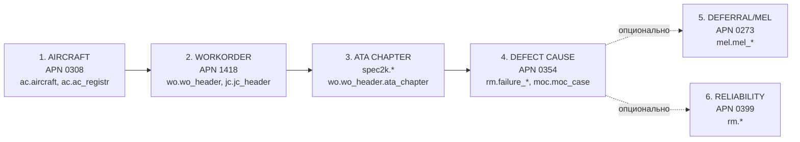

# Mapping зоны 2 кодификатора ЦУП → AMOS / IATA-732 / out-of-scope

> **Версия**: v1.1, TASK-014. AS-IS, Rule 0.
> **Источники истины**:
> 1. лист `ЦУП_МЕР_IATA` файла [`Кодификатор_ЦУП_МЕР_IATA_730_732.xlsx`](../../input2/ЦУП/Отчетность/Кодификатор_ЦУП_МЕР_IATA_730_732.xlsx),
>    строки 98..272 (текстовые расшифровки буквенных кодов ЦУП).
> 2. [`output/cup_codifier/matching.json`](../../output/cup_codifier/matching.json) — 80 MER-кодов AHM-730.
> **Артефакты**:
> [`output/amos_layer/cup_zone2_to_amos.json`](../../output/amos_layer/cup_zone2_to_amos.json),
> [`output/amos_layer/cup_zone2_to_amos.csv`](../../output/amos_layer/cup_zone2_to_amos.csv),
> [`output/amos_layer/amos_apn_catalog.json`](../../output/amos_layer/amos_apn_catalog.json),
> [`output/amos_layer/mer_amos_sources.json`](../../output/amos_layer/mer_amos_sources.json),
> [`output/amos_layer/mer_amos_sources.csv`](../../output/amos_layer/mer_amos_sources.csv).

## 0. Aircraft-centric AMOS lookup chain

По договорённости с человеком (2026-05-15): **в AMOS всё идёт от неисправного
ВС и далее обратным порядком до причины отказа**. Это диктует структуру
обращения к AMOS как цепочку из 6 шагов:



| Step | Node | APN | Назначение | Таблицы-hint |
|---:|---|---|---|---|
| 1 | aircraft | 0308 Aircraft Administration | вход в AMOS по хвостовому номеру ВС | `ac.aircraft`, `ac.ac_registr` |
| 2 | workorder | 1418 Workorder | snag/defect/scheduled по ВС | `wo.wo_header`, `wo.wo_event_chain`, `jc.jc_header` |
| 3 | ata_chapter | spec2k lookup | классификация по ATA chapter | `spec2k.*` + `wo.wo_header.ata_chapter` |
| 4 | defect_cause | 0354 Failure Confirmation | подтверждённая причина (BITE/pirep/inspection) | `rm.failure_*`, `moc.moc_case` |
| 5 | deferral_or_close | 0273 MEL Manual Administration | (опц.) отложен по MEL или закрыт | `mel.mel_*`, `wo.wo_header (deferral_link)` |
| 6 | reliability_aggregation | 0399 Systems Reliability | (опц.) агрегация по ATA / MTBF | `rm.*` |

В JSON-артефактах эта цепочка зашита как `amos_aircraft_centric_chain` (на
уровне документа) и как `amos_lookup_chain` (в каждой `ata_amos` записи —
шаги, которые применимы к этому конкретному кейсу). Никаких физических
обращений к БД AMOS не делается — все таблицы помечены как `_hint`.

## 1. Что сделано

Для каждой из 175 строк зоны 2 листа `ЦУП_МЕР_IATA` (включая 1 служебную
пустую строку 98 и 10 жирных заголовков-разделителей) проставлены поля:

- `cup_text` — точная цитата из источника (Rule 0).
- `cup_group` — буквенный код ЦУП-группы (`ДКЭ`, `ЛС`, `СОП`, `ПРЧ`, `ПДГ`, `НМЧ`, `М/У`, `СВС`, `ППС`, …).
- `category` — одно из:
  - `ata_amos` — кандидат на AMOS-слой (отказ системы ВС, ТО, MEL).
  - `iata732_process` — кандидат на L1+L2 (G + P) в IATA-732.
  - `iata732_stakeholder` — кандидат на stakeholder/Z в IATA-732.
  - `out_of_scope` — admin/IT/security/behaviour/мета — ни AMOS, ни IATA-732.
  - `section_header` — жирный разделитель секции.
  - `empty` — служебная пустая строка.
- `ata_chapter`, `amos_apn`, `amos_field`, `amos_table_hint` — для `ata_amos`.
- `iata732_target` — короткий ярлык для `iata732_*` (например `P:G7/Y`, `S:N`).
- `confidence` ∈ {`high`, `medium`, `low`, `gap`}.
- `rule0_note` — обоснование/комментарий.

Источниками APN-каталога стали:

- `webBI/amos-help/index.html` — TOC из **457** APN с EN/RU-именами.
- `webBI/amos-db-explorer.html` — **324** Oracle-модуля AMOS с именами таблиц.
- `webBI/amos-apn-analytics.md` — 25 used APN из xlsx «APN по отделам».

Боевая БД AMOS **не** опрашивалась. Все таблицы помечены как `table_hint`
(намёк, не контракт) — это требование от человека: «не надо никакой реальный
AMOS смотреть, только аналитические материалы и guide на webUI».

## 2. Сводка категорий

| Категория | Строк | Доля |
|---|---:|---:|
| `ata_amos` | 68 | 38.9 % |
| `iata732_process` | 48 | 27.4 % |
| `out_of_scope` | 29 | 16.6 % |
| `iata732_stakeholder` | 19 | 10.9 % |
| `section_header` | 10 | 5.7 % |
| `empty` | 1 | 0.6 % |
| **итого** | **175** | 100 % |

`confidence=high` для всех 175 строк (`gap=0`) — это означает, что под все
строки нашлось точное соответствие в Hardcoded словаре. Это **не** значит,
что разметка автоматически верна — это значит, что **она проверяема: каждая
запись имеет либо явный APN-маршрут, либо явный IATA-732-target, либо
обоснование `out_of_scope`**. Ручное ревью необходимо (см. §7).

## 3. Top AMOS APN-модулей (`ata_amos`, 68 строк)

| APN | Назначение | Строк | Зона ЦУП | Поле AMOS (Guide) | Таблицы (db-explorer hint) |
|---:|---|---:|---|---|---|
| **1418** | [Workorder](../../../todo/webBI/amos-help/APN1418.htm) | **62** | НМЧ-секция (171–231) + Навигационная БД (110), ВПП-заправка через ИТС (238) | Defect description / Component / ATA chapter / Task code | `wo.wo_header`, `wo.wo_event_chain`, `jc.jc_header` |
| **1844** | [Maintenance Forecast](../../../todo/webBI/amos-help/APN1844.htm) | 2 | Выполнение ТО (184, 239) | Task / Interval / ATA / Aircraft / Due / Finding | `mevt.*`, `msc.*` |
| **0354** | [Failure Confirmation](../../../todo/webBI/amos-help/APN0354.htm) | 1 | Расшифровка полётной информации (118) | Pilot report / FDR readout / ATA / Aircraft | `rm.*`, `moc.moc_case` |
| **0273** | [MEL Manual Administration](../../../todo/webBI/amos-help/APN0273.htm) | 1 | Ожидание термосов / открыт п. MEL (236) | MEL item / Cat / Deferral / linked WO | `mel.*`, `wo.wo_header` |
| **0869** | [Technical Assistance](../../../todo/webBI/amos-help/APN0869.htm) | 1 | Консультация КВС с ИТС (237) | TQ form U240 / ATA / Aircraft / Status | `moc.moc_case`, `moc.moc_case_log` |
| **1208** | [Shipment Tracking](../../../todo/webBI/amos-help/APN1208.htm) | 1 | Ожидание доставки компонентов (240) | Shipment / Component / Required date / ATA | `od.*`, `sh.*` |

**Главный AMOS-источник для слоя «техотказы» — APN 1418 Workorder**: 62 из 68
строк. Это согласуется с реальной AMOS-практикой: snags и дефекты ВС
оформляются как Component/Aircraft Work Orders с указанием ATA chapter
в полях header. Подключение к коммерческой БД AMOS (Oracle / PostgreSQL v21.6)
для этого требует доступа к таблицам `wo.wo_header` + `wo.wo_event_chain`
+ `jc.jc_header` (см. `amos_apn_catalog.json` для полного перечня таблиц).

## 4. Распределение по ATA chapters

Покрыто **26 разных ATA chapters**. Top по числу строк:

| ATA | Название (RU) | Строк |
|---:|---|---:|
| 34 | Навигация | 7 |
| 25 | Оборудование / интерьер | 5 |
| 23 | Связь и аудио | 5 |
| 33 | Светотехника | 4 |
| 24 | Электропитание | 4 |
| 32 | Шасси | 4 |
| 27 | Управление полётом | 4 |
| 21 | СКВ / Кондиционирование | 4 |
| 31 | Индикация и регистрация | 3 |
| 22 | Автоматическое управление | 2 |
| 38 | Водяная система / сан. узлы | 2 |
| 29 | Гидросистема | 2 |
| 30 | Противообледенительная защита | 2 |
| 71 | Силовая установка | 1 |
| 78 | Реверс тяги | 1 |
| 28 | Топливная система | 1 |
| 26 | Противопожарная защита | 1 |
| 49 | ВСУ | 1 |
| 50 | Багажные/грузовые отсеки | 1 |
| 52 | Двери | 1 |
| 53 | Фюзеляж | 1 |
| 54 | Пилоны / гондолы | 1 |
| 56 | Остекление | 1 |
| 61 | Воздушные винты | 1 |
| 35 | Кислородное оборудование | 1 |
| 12 | Регламентное обслуживание | 1 |
| **итого** | | **60** |

> **Note**: 60 строк имеют ATA chapter; остальные 8 `ata_amos` строк (стр.118,
> 184, 236, 237, 238, 239, 240 + 1 спец-кейс) уходят в AMOS-модули без
> привязки к chapter (Maintenance Forecast / Technical Assistance / Shipment /
> Failure Confirmation / MEL Admin). Это нормально по Rule 0: chapter
> определяется уже **внутри** конкретного WO/MEL/case на стороне AMOS.

## 5. Top IATA-732 targets (`iata732_process` + `iata732_stakeholder`, 67 строк)

| Target | Описание | Строк |
|---|---|---:|
| `S:N` | Stakeholder — Airline crew | 12 |
| `P:G6/W` | Process — Weather | 10 |
| `P:G5/P` | Process — Passengers (boarding/disembark) | 8 |
| `P:G4/L` | Process — Catering / cabin servicing | 8 |
| `P:G3/H` | Process — Ground handling on stand | 6 |
| `S:A` | Stakeholder — Airline / handler | 5 |
| `P:G4/N` | Process — Crew (flight operations) | 4 |
| `P:G1/A` | Process — Passenger / baggage on ground | 3 |
| `P:G7/Y` | Process — Aircraft defects (нац. отказы — техника) | 3 |
| `P:G3/E` | Process — Fuelling | 2 |
| `S:G` | Stakeholder — Government / regulator | 2 |
| `P:G2/D` | Process — Cargo & mail (loading) | 2 |
| `P:G7/Z` | Process — ATFM / technical interruption | 2 |
| **итого** | | **67** |

Это **входной материал для следующей итерации** — доработка
[`matching.json`](../../output/iata732/matching.json) и
[`cup_overlay.json`](../../output/iata732/cup_overlay.json) без эвристики
`code2_index` (см. §8).

## 6. Out-of-scope (29 строк)

Группы строк, которые **не закрываются ни AMOS, ни IATA-732**:

| Подгруппа | Строки | Обоснование |
|---|---|---|
| ППС-секция (post-causal segments) | 260–272 (13 строк) | Это **деривативные коды**: «что произошло после первичного RZM-кода», а не самостоятельный класс задержки. Не имеют прямого target ни в AMOS, ни в IATA-732. |
| Медицинские события | 141, 142, 146 (3 строки) | S:M (medical) — стакхолдер за рамками IATA-732 AS-IS; AMOS не отслеживает. |
| Поведенческие пассажиры | 132, 147, 155, 156 (4 строки) | depart. control / СЗВ / САБ — security/behavioural, не AMOS, частично S:G/S:S. |
| IT/системные сбои | 152, 153, 154 (3 строки) | DCS / Internet / UTG — не AMOS, отдельный IT-домен. |
| Admin/документы | 131, 143, 150 (3 строки) | визы / СЗВ / рассадка — административные операции. |
| Прочее (мета/умбрелла) | 99 (ЦУП распределения), 140 (заминирование), 235 (СБОЙ прочее) | мета-метка / security event / коллективная зонт-категория. |

## 7. Жирные заголовки-разделители зоны 2 (10 строк)

Сохранены как `section_header` для целостности структуры, не размечаются как
кейсы задержек:

| Row | Cup-text | Cup-group |
|---:|---|---|
| 99  | ЦУП распределения | КОД |
| 100 | ДКЭ | ДКЭ |
| 107 | ЛС  | ЛС  |
| 120 | СОП | СОП |
| 130 | Прочие причины | ПРЧ |
| 158 | ПДГ | ПДГ |
| 170 | НМЧ | НМЧ |
| 241 | М/У | _(пусто)_ |
| 252 | СВС | _(пусто)_ |
| 259 | ППС | _(пусто)_ |

## 8. AMOS-источники для 80 MER из `matching.json`

Это **новый блок** по запросу человека: для всех 80 MER-кодов (из
[`output/cup_codifier/matching.json`](../../output/cup_codifier/matching.json))
указан источник в AMOS, если он применим. Физическое подключение не делается —
это **только аналитика**.

Полные данные:
[`output/amos_layer/mer_amos_sources.json`](../../output/amos_layer/mer_amos_sources.json),
[`output/amos_layer/mer_amos_sources.csv`](../../output/amos_layer/mer_amos_sources.csv).

### 8.1. Сводка

| Группа | MER-кодов | Доля |
|---|---:|---:|
| AMOS-relevant (источник — AMOS) | **9** | 11.2 % |
| Not-AMOS (источник — IATA-732 process/stakeholder, ATFM, regulator, или мета/ППС) | 71 | 88.8 % |
| **итого** | **80** | 100 % |

> **Это и есть точный ответ на вопрос «куда уходят 57 MER из code2_index».**
> Семантически AMOS-источниками являются **9 MER** (отказ/повреждение/ТО ВС);
> остальные 71 — handling/passengers/cargo/crew/weather/ATFM/security/мета,
> для них **AMOS не является источником истины**, а letter-matching через
> `code2_index` в этих случаях даёт корректные IATA-732 targets.

### 8.2. AMOS-relevant MER (9 строк)

| MER | Группа | iata730 | Описание | Primary APN | Primary table | Шаги цепочки |
|---:|---|---|---|---|---|---|
| **41** | НМЧ | 41 (TD) | Неисправность мат. части ВС | 1418 Workorder | `wo.wo_header` | 1→2→3→4→5→6 |
| **42** | НМЧ | 42 (TM) | Плановое ТО | 1844 Maintenance Forecast | `mevt.*`, `msc.*` | 1→2→3 |
| **44** | НМЧ | 44 (TS) | Зап. части и рем. оборуд-е | 0204 Parts Consumption Forecast | `part.*`, `od.*` | 1→2→3 |
| **45** | СБОЙ | 45 (TA) | Зап. части для транспортировки | 1208 Shipment Tracking | `od.*`, `sh.*` | 1→2 |
| **46** | НМЧ | 46 (TC) | Замена ВС/типа ВС по тех. прич. | 0308 Aircraft Administration | `ac.aircraft`, `wo.wo_header` | 1→2→3→4 |
| **47** | СБОЙ | 47 (TL) | Отсутствие ВС по тех. причинам | 1683 Technical Availability Performance | `ac.aircraft`, `mevt.*`, `wo.wo_header` | 1→2→3→4 |
| **48** | ПРЧ | 48 (TV) | Внеплановое изм-е компоновки | 0308 Aircraft Administration | `cm.*`, `ac.aircraft` | 1→2 |
| **51** | ПВС | 51 (DF) | Поврежд. ВС в полёте/на руле | 1418 Workorder | `wo.wo_header`, `moc.moc_case` | 1→2→3→4 |
| **52** | ПВС | 52 (DG) | Повреждение ВС на земле | 1418 Workorder | `wo.wo_header`, `moc.moc_case` | 1→2→3→4 |

**Пограничный случай** (`amos_relevant=False`, но с возможной AMOS-привязкой):

| MER | Описание | Замечание |
|---:|---|---|
| 43 | Запуск от УВЗ/Ожидание роднички | GPU/ground power unit — GSE handling; AMOS может зафиксировать как ATA-24/49 servicing, но первичная регистрация на стороне handler. |

### 8.3. Распределение not-AMOS причин (71 MER)

| Тип источника | MER-кодов | Примеры |
|---|---:|---|
| Passenger flow (IATA-732 G5/P) | ~9 | 11, 12, 13, 14, 15, 18, 19, 55 |
| Cargo & mail (IATA-732 G2/D) | ~8 | 21, 22, 23, 24, 25, 27, 28, 32, 56 |
| Ground handling (IATA-732 G3/H) | ~6 | 33, 34, 35, 38, 39 |
| Fuelling / catering | ~3 | 17, 36, 37 |
| Crew (IATA-732 S:N / G4/N) | ~9 | 61, 62, 63, 64, 65, 66, 67, 68, 94, 95 |
| Weather / runway (IATA-732 G6/W) | ~6 | 71, 72, 73, 75, 76, 77, 84 |
| ATFM / airport restrictions (IATA-732 G7/Z) | ~7 | 81, 82, 82.1, 83, 83.1, 87, 88, 89 |
| Security (IATA-732 S:S) | ~3 | 69, 85, 86 |
| Documents / admin | ~2 | 31 |
| Transit / transfer | ~2 | 91, 92 |
| ППС (post-causal segments) | ~7 | 93, 93.1, 93.2, 93.3, 93.4, 93.5, 93.6 |
| Internal / null / strike | ~5 | 9, 16, 96, 97, 98, 99, `Столбец1` |

Точные пометки — в `mer_amos_sources.json` (поле `not_amos_reason`).

## 9. Открытые вопросы / следующая итерация

Это **не** часть TASK-014. Перечень того, что зависит от результата этого
маппинга и решается в следующей итерации (по согласованию с человеком).

### 9.1. «code2_index» — вопрос закрыт

Из 71 letter-matched MER **только 9 семантически относятся к AMOS** (см. §8.2).
Это значит: семантические mismatch'ы из 57 «проблемных» letter-pairs (например
86 AG «Погран. контроль» ↔ G1/A/G «FOD check») в большинстве случаев **не
лечатся через AMOS-слой** — это операционка, и corrections нужны внутри
самого IATA-732 mapping. AMOS-слой даёт **только дополнительный аналитический
слой для 9 MER технических причин и 68 строк зоны 2** (НМЧ-секция Excel).

### 9.2. Расширение `matching.json`

К существующей структуре `matching.json` добавить поле `amos_layer` рядом
с `iata732_targets`:

```json
{
  "cup_code": "НМЧ",
  "iata732_targets": ["P:G7/Y"],
  "amos_layer": {
    "primary_apn": "1418",
    "primary_apn_name": "Workorder",
    "ata_distribution": {"34": 7, "25": 5, "23": 5, ...}
  }
}
```

### 9.3. Расширение `cup_overlay.json` для Sankey

Добавить overlay-режим **«AMOS layer»** в дашборд IATA-732, который окрашивает
ноды Sankey по тому, есть ли у них ATA-детализация в AMOS (зелёный — есть,
серый — нет). Альтернатива — отдельная новая вкладка «Технические отказы / ATA»
с собственной диаграммой по 60 строк ATA-разбивки.

### 9.4. Подключение к боевой БД AMOS — НЕ ДЕЛАЕМ

> Решение человека (2026-05-15): «**физически подтаскивать данные амос не
> надо**».

Перечень таблиц/полей зафиксирован как `_hint` в JSON-артефактах — на случай
если в будущем потребуется подключение, всё необходимое для постановки
задачи ИТ уже выписано. Сама инфраструктурная задача остаётся вне scope
TASK-014.

## 10. Воспроизводимость

```bash
cd /home/budnik_an/Obligations
python3 scripts/build_amos_apn_catalog.py   # output/amos_layer/amos_apn_catalog.json
python3 scripts/build_cup_zone2_to_amos.py  # output/amos_layer/cup_zone2_to_amos.{json,csv}
python3 scripts/build_mer_amos_sources.py   # output/amos_layer/mer_amos_sources.{json,csv}
```

Зависимости: `openpyxl`. Новых зависимостей не добавлено.

Ownership: `scripts/` (coder, по плану), `output/` (свободно по правилам),
`docs/reports/` (scribe / свободно).
